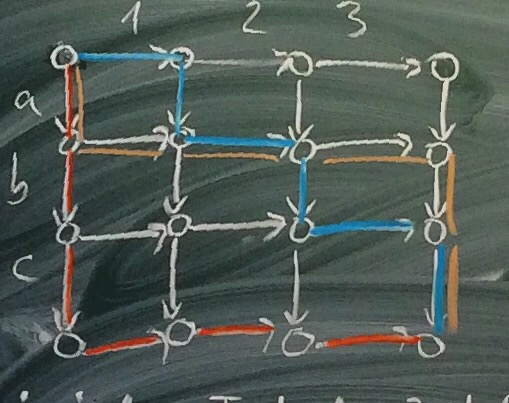

## Thread-Programmierung
### Gliederung
1. Grundbegriffe
	1. Threads
	2. Nicht-Determinismus
	3. Kritische Bereiche
	4. Sperren
2. Verifikation
	1. Zeitliche Abläufe
	2. Serielle Abläufe
	3. Faire Mischung
	4. Sicherheits- und Liveness-Eigenschaften
	5. Modellierung
3. Synchronisation
	1. Signale (Bsp. Erzeuger/Verbraucher)
	2. Semaphore
	3. Bedingte kritische Bereiche
	4. Wiederbehebbare Sperre
	5. Leser/Schreiber-Problem
4. Feinkörnige Nebenläufigkeit
	1. Methoden (Bsp. Mengen)
	2. Grobkörnig
	3. Feinkörnig
	4. Optimistisch
	5. Faul
	6. Mit atomaren Befehlen
5. Implementierung
	1. Atomare Befehle
	2. Konsenzzahlen
	3. Zwischenspeicher
	4. Bäckerei-Algorithmus
6. Transactional Memory
	1. Probleme mit Sperren
	2. Transaktionen
	3. STM: Transaktionsstatus, Transactional Thread, 2 Implementierungen

Literatur:
- Maurice Herlihy, Nir Shavit: The Art of Multiprocessor Programming. Morgan Kaufmann 2008.
- Kelvin Lin, Larry Snyder: Principles of Parallel Programming. Addison Wesley.
- Greg Andrews: Concurrent Programming. Addison Wesley 1991.
- Brian Goetz u.a.: Java Concurrency in Practice. Addison Wesley 2006.

## 1. Grundbegriffe
### 1.1. Threads
**Prozess (hier)** := sequentieller Rechenvorgang  
**Sequentiell (auch: seriell) **:= Alle Rechenschritte laufen nacheinander ab in einer vorgegebenen Reihenfolge.  
**Thread (deutsch: Faden)** := leichte Variante eines Prozesses

###### Allgemeine Tendenz:
1. Systemkern möglichst schlank halten
2. Systemkern möglichst selten betreten

###### Unterschied zu Prozess:
- kein eigener Speicherbereich
- üblicherweise nicht vom Systemkern verwaltet

###### „Leichtprozess“ (engl. light-weight prozess):
- vom Systemkern verwaltet
- Vorteile:
	- Wechsel zwischen Threads weniger aufwendig als Wechsel zwischen Prozessen
	- Threads benötigen weniger Speicher
	- man kann viel mehr Threads (≈10000) als Prozesse (≈100) laufen lassen.
- Nachteile:
	- Der Anwendungsprogrammierer muss sich um die Verwaltung der Threads kümmern 

Viele Programmiersprachen bieten heute Programmbibliotheken für Threads an (Beispiel: PThread in C). Wir verwenden in dieser Veranstaltung Java als Programmiersprache.

**Parallel** := mehrere Threads laufen gleichzeitig auf verschiedenen Rechnerkernen.  
**Verschränkt (engl. interleaved)** := die Threads laufen abwechselnd je ein Stück weit  
**Nebeneinander laufend (auch: nebenläufig, engl. concurrent)** := mehrere Threads laufen parallel oder miteinander verschränkt.  
Auch Mischformen sind möglich.

###### Unterschied:
- **Rechenzeit (engl. CPU time)** := Zeit, die der Prozessor mit Rechnen zubringt
- **Bearbeitungszeit (engl. wall clock time)** := umfasst auch Wartezeiten

##### Amdahlsches Gesetz (Gene Amdahl 1967):
> Wenn eine Aufgabe die Bearbeitungszeit `a` benötigt, und der Anteil `0 ≤ p ≤ 1` davon parallelisiert ist, dann benötigt sie die Bearbeitungszeit  
> `a * (1 - p + p/n)`.

Beispiel: `p = 9/10, n = 100`.
Beschleunigung (engl. speedup) = `a / (a (1 - p + p/n))` = `1 / (1 - 9/10 + 9/1000)` ≈ 9,17

Sogar `lim[n → ∞] 1 / (1 - p + p/n)` = `1 / (1 - p)` = 10.

*Fazit*: Der nicht-parallelisierbare Anteil dominiert die Bearbeitungszeit.

## 1.2. Nicht-Determinismus
**Nicht-Determinismus** := das Verhalten eines Systems hat Freiheitsgrade
Nicht-Determinismus hat zwei Anwendungen:
1. Möglichkeiten des Verhaltens der Systemumgebung zusammenfassen (engl. don’t know nondeterminism).
2. Spielraum für Implementierungen (engl. don’t care nondeterminism).

Hier: System von Threads.  
Man muss davon ausgehen, dass die Rechenschritte des Threads beliebig miteinander verschränkt sind. Die Reihenfolge der Schritte eines Threads ist durch sein Programm vorgegeben („Programm-Reihenfolge“).

Der *Zeitplaner* (engl. scheduler) legt zur Laufzeit fest, in welcher Reihenfolge die Schritte zweier Threads zueinander ablaufen. Man möchte den Zeitplaner in seiner Entscheidungsfreiheit nicht unnötig einschränken, sondern einen möglichst großen Spielraum lassen. Man verlangt deshalb, dass das System von Threads korrekt arbeitet unabhängig davon, wie der Zeitplaner die Verschränkung bildet. Don’t know nondeterminism aus Sicht des Anwendungsprogrammierers, don’t care nondeterminism aus Sicht des Zeitplaners.

Beispiel:  
Thread 1 führt aus ① ② ③.  
Thread 2 führt aus ⓐ ⓑ ⓒ.  
Beispiele für mögliche Abläufe:
- ① ⓐ ② ⓑ ③ ⓒ (blau)
- ⓐ ⓑ ⓒ ① ② ③ (rot)
- ⓐ ① ⓑ ② ⓒ ③ (schlamm)
- …

Da bei jedem Test der Zeitplaner eine andere Ausführungsreihenfolge („Umstände des Wettrennens“, engl. race condition) wählen kann, ist der Test praktisch nicht reproduzierbar. Wegen der großen Anzahl möglicher Abläufe ist ein systematisches Testen aussichtslos („Zustandsexplosion“).