## Thread-Programmierung
### Gliederung
1. Grundbegriffe
	1. Threads
	2. Nicht-Determinismus
	3. Kritische Bereiche
	4. Sperren
2. Verifikation
	1. Zeitliche Abläufe
	2. Serielle Abläufe
	3. Faire Mischung
	4. Sicherheits- und Liveness-Eigenschaften
	5. Modellierung
3. Synchronisation
	1. Signale (Bsp. Erzeuger/Verbraucher)
	2. Semaphore
	3. Bedingte kritische Bereiche
	4. Wiederbehebbare Sperre
	5. Leser/Schreiber-Problem
4. Feinkörnige Nebenläufigkeit
	1. Methoden (Bsp. Mengen)
	2. Grobkörnig
	3. Feinkörnig
	4. Optimistisch
	5. Faul
	6. Mit atomaren Befehlen
5. Implementierung
	1. Atomare Befehle
	2. Konsenzzahlen
	3. Zwischenspeicher
	4. Bäckerei-Algorithmus
6. Transactional Memory
	1. Probleme mit Sperren
	2. Transaktionen
	3. STM: Transaktionsstatus, Transactional Thread, 2 Implementierungen

Literatur:
- Maurice Herlihy, Nir Shavit: The Art of Multiprocessor Programming. Morgan Kaufmann 2008.
- Kelvin Lin, Larry Snyder: Principles of Parallel Programming. Addison Wesley.
- Greg Andrews: Concurrent Programming. Addison Wesley 1991.
- Brian Goetz u.a.: Java Concurrency in Practice. Addison Wesley 2006.

## 1. Grundbegriffe
### 1.1. Threads
**Prozess (hier)** := sequentieller Rechenvorgang  
**Sequentiell (auch: seriell) **:= Alle Rechenschritte laufen nacheinander ab in einer vorgegebenen Reihenfolge.  
**Thread (deutsch: Faden)** := leichte Variante eines Prozesses

###### Allgemeine Tendenz:
1. Systemkern möglichst schlank halten
2. Systemkern möglichst selten betreten

###### Unterschied zu Prozess:
- kein eigener Speicherbereich
- üblicherweise nicht vom Systemkern verwaltet

###### „Leichtprozess“ (engl. light-weight prozess):
- vom Systemkern verwaltet
- Vorteile:
	- Wechsel zwischen Threads weniger aufwendig als Wechsel zwischen Prozessen
	- Threads benötigen weniger Speicher
	- man kann viel mehr Threads (≈10000) als Prozesse (≈100) laufen lassen.
- Nachteile:
	- Der Anwendungsprogrammierer muss sich um die Verwaltung der Threads kümmern 

Viele Programmiersprachen bieten heute Programmbibliotheken für Threads an (Beispiel: PThread in C). Wir verwenden in dieser Veranstaltung Java als Programmiersprache.

**Parallel** := mehrere Threads laufen gleichzeitig auf verschiedenen Rechnerkernen.  
**Verschränkt (engl. interleaved)** := die Threads laufen abwechselnd je ein Stück weit  
**Nebeneinander laufend (auch: nebenläufig, engl. concurrent)** := mehrere Threads laufen parallel oder miteinander verschränkt.  
Auch Mischformen sind möglich.

###### Unterschied:
- **Rechenzeit (engl. CPU time)** := Zeit, die der Prozessor mit Rechnen zubringt
- **Bearbeitungszeit (engl. wall clock time)** := umfasst auch Wartezeiten

##### Amdahlsches Gesetz (Gene Amdahl 1967):
> Wenn eine Aufgabe die Bearbeitungszeit a benötigt, und der Anteil 0 ≤ p ≤ 1 davon parallelisiert ist, dann benötigt sie die Bearbeitungszeit  
> `a * (1 - p + p/n)`.

Beispiel: `p = 9/10, n = 100`.
Beschleunigung (engl. speedup)  
= `a / (a * (1 - p + p/n))`  
= `1 / (1 - 9/10 + 9/1000)`  
≈ 9,17

Sogar `lim[n → ∞] 1 / (1 - p + p/n)` = `1 / (1 - p)` = 10.

*Fazit*: Der nicht-parallelisierbare Anteil dominiert die Bearbeitungszeit.

### 1.2. Nicht-Determinismus
**Nicht-Determinismus** := das Verhalten eines Systems hat Freiheitsgrade
Nicht-Determinismus hat zwei Anwendungen:
1. Möglichkeiten des Verhaltens der Systemumgebung zusammenfassen (engl. don’t know nondeterminism).
2. Spielraum für Implementierungen (engl. don’t care nondeterminism).

Hier: System von Threads.  
Man muss davon ausgehen, dass die Rechenschritte des Threads beliebig miteinander verschränkt sind. Die Reihenfolge der Schritte eines Threads ist durch sein Programm vorgegeben („Programm-Reihenfolge“).

Der *Zeitplaner* (engl. scheduler) legt zur Laufzeit fest, in welcher Reihenfolge die Schritte zweier Threads zueinander ablaufen. Man möchte den Zeitplaner in seiner Entscheidungsfreiheit nicht unnötig einschränken, sondern einen möglichst großen Spielraum lassen. Man verlangt deshalb, dass das System von Threads korrekt arbeitet unabhängig davon, wie der Zeitplaner die Verschränkung bildet. Don’t know nondeterminism aus Sicht des Anwendungsprogrammierers, don’t care nondeterminism aus Sicht des Zeitplaners.

Beispiel:  
Thread 1 führt aus ① ② ③.  
Thread 2 führt aus ⓐ ⓑ ⓒ.  
Beispiele für mögliche Abläufe:

- ① ⓐ ② ⓑ ③ ⓒ (blau)
- ⓐ ⓑ ⓒ ① ② ③ (rot)
- ⓐ ① ⓑ ② ⓒ ③ (schlamm)
- …


Da bei jedem Test der Zeitplaner eine andere Ausführungsreihenfolge („Umstände des Wettrennens“, engl. race condition) wählen kann, ist der Test praktisch nicht reproduzierbar. Wegen der großen Anzahl möglicher Abläufe ist ein systematisches Testen aussichtslos („Zustandsexplosion“).

Der Entickler muss deswegen die Korrektheit seines Programmes mathematisch beweisen („verifizieren“). Um Flüchtigkeitsfehler und übersehene Spezialfälle auszuschließen, führt man die Beweise mit Assistenzwerkzeugen durch und lässt die Beweise maschinell überprüfen: „Formale Verfifikation“.

Threads sind asynchron, das heißt, sie laufen mit verschiedenen Geschwindigkeiten. Es treten Wartezeiten auf, deren Zeitpunkt und Dauer nicht vorhersehbar ist, z.B. eine neue Speicherseite muss geladen werden („page fault“), oder ein Zugriff auf den Zwischenspeicher (cache) scheitert.

### 1.3. Kritische Bereiche
Beispiel: Zähler mit Threads *z* ist eine *gemeinsame Variable* (auch: gemeinsamer Speicher, engl. shared memory,  gemeinsames Objekt)

z++ wird vom Compiler sinngemäß so übersetzt:

1. `int temp := z;`
2. `temp := temp + 1;`
3. `z := temp;`

Beispielablauf für 3 verschiedene Threads:  
Sei z = 0 zu Anfang. Jeder Thread hat seine Version von temp. Der Wert von *z* sollte am Ende 3 sein.

```
	      p1      |       p2      |       p3      | z
	--------------|---------------|---------------|---
	Zeile | temp1 | Zeile | temp2 | Zeile | temp3 | 0
	------|-------|-------|-------|-------|-------|---
	   1  |   0   |       |       |       |       |
	      |       |   1   |   0   |       |       |
	      |       |   2   |   1   |       |       |
	      |       |   3   |       |       |       | 1
	      |       |       |       |   1   |   1   |
	      |       |       |       |   2   |   2   |
	      |       |       |       |   3   |       | 2
	   2  |   1   |       |       |       |       |
	   3  |       |       |       |       |       | 1
```

Threads p1, p2 p3 kommen sich gegenseitig in die Quere: *Einmischung* (eng. interference). Einmischung kann es nur über gemeinsame Variablen geben. Eine Methode, Einmischung zu verhindern, ist die Verwendung von kritischen Bereichen.

Kritischer Bereich (auch: kritischer Abschnitt, engl. critical region, critical section) := Programmfragment, in dem sich zu jedem Zeitpunkt höchstens ein Thread befindet.

Ein kritischer Bereich ist ein „exklusives“ Betriebsmittel. Wenn sich ein Thread im kritischen Bereich befindet, dann werden alle anderen Threads davon abgehalten, den kritischen Bereich zu betreten (*„gegenseitiger Ausschluss“*, engl. mutual exclusion).

Beispiele für exklusive Betriebsmittel:
- Rechnerkern
- Schreibzugriff auf Speicherblock
- Schreibzugriff auf Bus
- Drucker

Schreibweise: `gemeinsam int z := 0;`  
(deklariert eine gemeinsame Variable z)

	kritisch z {
		z++
	}

Nur innerhalb des kritischen Bereichs darf auf die gemeinsame Variable zugegriffen werden. Wenn kritische Bereiche als Sprachkonstrukt gegeben sind, kann der Compiler die korrekte Verwendung kritischer Bereiche überprüfen.

### 1.4. Sperren
Sperre (engl. lock) := Datenstruktur mit zwei möglichen Zuständen („belegt“ und „frei“) und zwei Zugriffsoperationen („belegen“ und „freigeben“).

Sperre `l` ist frei, wenn `l.frei` = `true`.

	belegen(l):
		Warten solange l.frei = false.
		Setze l.frei = false.
	
	freigeben(l):
		Setze l.frei = true.

Sperren können verwendet werden, um kritische Bereiche zu implementieren.

Beispiel: Sperre `l` beacht die gemeinsame Variable *z*.  
Programm:
- Sperre `l` anlegen mit `l.frei = false`.
- Threads anlegen. Setze gemeinsame Variable z = 0.
- `freigeben(l)`.

Thread: 
- ⓪ `belegen(l);`
- ① ② ③ `z++;`
- ④ `freigeben(l);`

Beispielablauf für 2 Threads nach `freigeben(l)` des Hauptprogramms:

```
	      p1      |       p2      | z | l.frei | Bemerkung
	--------------|---------------|---|--------|----------
	Zeile | temp1 | Zeile | temp2 | 0 |  true  |
	------|-------|-------|-------|   |        |
	   0  |       |       |       |   |  false |
	      |       |   0   |       |   |        | p2 wartet in Z. 0
	   1  |   0   |   0   |       |   |        |
	   2  |   1   |   0   |       |   |        | 
	   3  |       |   0   |       | 1 |        |
	   4  |       |   0   |       |   |  true  |
	      |       |   0   |       |   |  false | Ende der Wartezeit
	      |       |   1   |   1   |   |        |
	      |       |   2   |   2   |   |        |
	      |       |   3   |       | 2 |        |
	      |       |   4   |       |   |  true  |
```

Sprechweise:
- „Thread `p` *bewirbt sich* für die Sperre `l`“ bedeutet: `p` ruft `belegen(l)` auf
- „`p` *erwirbt* `l`“ bedeutet: `p` betritt den kritischen Bereich; p beendet den Aufruf `belegen(l)`.
- „`p` *besitzt* `l`“ bedeutet: `p` ist im kritischen Bereich
- Streit um die Sperre (engl. lock contention)

## 2. Verifikation
### 2.1. Zeitliche Abläufe
Vorgegeben: Menge A von Aktionen

**Ereignis (hier)** := Paar bestehend aus Aktion und Zeitpunkt

Zu einem Ereignis e soll `aktion(e)` die Aktion ausdrücken und `zeit(e)` den Zeitpunkt, an dem die Aktion stattfindet.

Idealisierende Annahmen:
1. Alles findet praktisch am selben Ort statt (sonst: verteilte Systems)
	→ Keine Probleme mit der Lichtgeschwindigkeit
	Zeit (hier) := Newtonsche Zeit
	Zeitpunkte := reelle Zahlen
	Newtonsche Zeit verläuft:
	- absolut, das heißt unabhängig vom Beobachter (sonst: spezielle Relativitätstheorie)
	- stetif, das heißt ohne Sprünge (sonst: Quantenmechanik)
	- unbeeinflusst von der Umgebung (z.B. Temperatur, sonst: allgemeine Relativitätstheorie)
2. Ein Ereignis hat die Dauer Null.
	Einen Zeitraum kann man darstellen durch die Ereignisse „Beginn des Zeitraumes“ und „Ende des Zeitraumes“.
3. Gleichzeitige Ereignisse sind gleich:
	`zeit(e₁) = zeit(e₂)` ⇒ `e₁ = e₂`

**Diskreter zeitlicher Ablauf (auch: Geschichte)** := Menge E von Ereignissen sodass

1. die Menge der Zeitpunkte von E keinen Häufungspunkt und
2. die Menge der Zeitpunkte von E ein kleinstes Element hat.

Sonst: kontinuierliche Vorgänge (Reaktive Systeme).

Inkrement sind hier nicht die Zeitpunkte selber, sondern nur deren Lage zueinander, das heißt die Reihenfolge der Aktionen. Sonst: Echtzeitsysteme.

Relation „→“ „kommt vor“ zwischen Ereignissen ist definiert als:

	e₁ → e₂ ⟺ zeit(e₁) < zeit(e₂)
(Leslie Lamport 1978)

Es gilt: → ist irreflexiv, transitiv, total, fundiert (also eine Wohlordnung).

##### Definition
Eine Relation R ≤ E ⨉ E auf der Menge E heißt

- *irreflexiv,* falls für alle e ∈ E gilt, (e, e) ∉ R.
- *transitiv,* falls für alle e₁, e₂, e₃ ∈ E gilt:
	Falls (e₁, e₂) ∈ R und (e₂, e₃) ∈ R, dann (e₁, e₃) ∈ R.
- *total,* für alle e₁, e₂ ∈ E gilt:
	Falls e₁ ≠ e₂, dann (e₁, e₂) ∈ R oder (e₂, e₁) ∈ R.
- *fundiert,* falls es keine unendliche Folge (eᵢ)\_{i ∈ N} gibt mit eᵢ ∈ E für alle i ∈ N  
	i ↦ eᵢ  
	und (eᵢ, eᵢ₊₁) ∈ R für alle i ∈ N.

###### Einschub:
R ist *azyklisch,* falls es keine endliche Folge (e₁, … eᵢ) gibt mit (e₁, e₂) ∈ R, (e₂, e₃) ∈ R, …, (eᵢ₋₁, eᵢ) ∈ R, (eᵢ, e₁) ∈ R.

Es gilt: Falls R irreflexiv und transitiv ist, dann ist R auch azyklisch. Für eine nicht leere Geschichte E sei *min E* definiert als das kleinste Element von E bezüglich →, das heißt dasjenige e ∈ E, für das gilt: ∀ f ∈ E \\{e}: e → f  
(Das ist eine implizite Definition, also schlecht. [Anm. d. schreib. Stud.])

**Implizite Definition** := Definition durch eine charakteristische Eigenschaft.

**Wohldefiniertheit der impliziten Definition** := Es gibt genau ein Objekt, das die charakteristische Eigenschaft erfüllt.

Wohldefiniertheit von *min E* gilt, weil → total und E (mindestens) ein kleinstes Element hat.

Das i-te Ereignis aus E (in Symbolen Eⁱ) ist dann für i ∈ N, i ≤ |E| rekursiv definiert durch

	Eⁱ = { min E, falls i = 1,
	     { (E\{min E}ⁱ⁻¹, sonst

Auch hier ist die Wohldefiniertheit zu zeigen.

Projektion auf eine Menge B von Aktionen („Sicht“):

	(π_B)(E) := {e ∈ E | aktion(e) ∈ B}

Zustand zum Zeitpunkt t ∈ R:

	(z_t)(E) := {e ∈ E | zeit(e) < t}.

„→“ für Zeiträume:


A → B: ⟺ Ende des Zeitraums A kommt vor Beginn des Zeitraums B  
Es gilt: → für Zeiträume ist **nicht** total.  
Wenn sich A und B überlappen, gilt weder A → B noch B → A.

**Prozessalphabet ⍺(p)** := Menge der Aktionen, die der Thread p „sieht“

Gemeinsame Aktionen von p₁ und p₂: ⍺(p₁)∩⍺(p₂)

**Einigkeit (engl. match)** := Ereignisse mit gemeinsamen Aktionen finden gemeinsam statt:

1. π\_{⍺(p₁) ∩ ⍺(p₂)}(E₁ ∪ E₂) = E₁ ∩ E₂
	Gleichwertig zu 1. sind:
2. π\_{⍺(p₁) ∩ ⍺(p₂)}(E₁ ⊗ E₂) = Ø
3. π\_{⍺(p₁)}(E₂) = π\_{⍺(p₂)}(E₁)

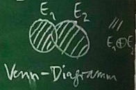

Eᵢ Ereignisse von Thread i  
Es gilt: ∀ e ∈ Eᵢ: aktion(e) ∈ ⍺(pᵢ)  
Faire Mischung: E₁∪E₂  
Es gilt: π\_{⍺(pᵢ)}(E₁∪E₂) = Eᵢ, für i ∈ {1, 2}, falls sich p₁ und p₂ einig sind.

### 2.2. Serielle Abläufe
Wenn man nicht an den Zeitpunkten der Ereignisse interessiert ist, sondern nur an ihrer Lage zueinander, kann man statt einer Ereignismenge auch eine Aktionenfolge als Beschreibungsmittel für einen Ablauf nehmen.

Beispiele: Sei A = {a, b}.  
Endliche Folge (a, b, a) kann auch dargestellt werden als Funktion  
f: {1, 2, 3} → A mit

	f(x) = { a, falls x = 1 oder x = 3,
	       { b, sonst.

Wertetabelle von f:

```
	  x  | 1 2 3
	-----|-------
	f(x) | a b a
```
Unendliche Folge (a, b, b, a, b, b, …) als Funktion f: N → A mit

	f(x) = { a, falls x mod 3 = 1
	       { b, sonst.

(Miteinander identifiziert:)  
Aᵏ k-Tupel von Elementen aus A  
{i ∈ N | i ≤ k} → A Folgen der Länge k

Um endliche und unendliche Abläufe einheitlich zu modellieren, bildet man die Positionenmenge

	N_∞ := N₀ ∪ {∞}.

Vergleich ≤ auf N\_{∞} sei definiert durch

	m ≤ n ⟺ (n = ∞) ∨ m, n ∈ N₀ ∧ m ≤ n

Vergleich m ≤ n für m, n ∈ N₀ liefert dasselbe bei ≤ auf N\_{∞} wie bei ≤ auf N₀.  
Man sagt auch: ≤ auf N\_{∞} ist eine *Fortsetzung* von ≤ auf N₀.

\< auf N\_{∞} sei definiert durch m \< n ⟺ m ≤ n ∧ m ≠ n.

Es gilt: \< auf N\_{∞} ist eine Fortsetzung von \< auf N₀ und eine Wohlordnung.  
Bemerkung: ≤ lässt sich nicht weiter fortsetzen: „Ordinalzahlen“.

Sei A eine Aktionenmenge.  
Dann sei A\* := ∪\_{k ∈ N₀} Aᵏ  
A^{∞} := A\*[^1] ∪ (N → A)[^2]  
Es gilt: A^{∞} = ∪\_{k ∈ N₀} ({i ∈ N | i ≤ k} → A)  
Die Länge \#\_{x} einer Aktionenfolge x ist definiert durch

	#_{x} = { ∞, falls x ∈ (N → A)
	        { k, falls x ∈ Aᵏ

Es gilt \#\_{x} ∈ N\_{∞}.  
≤\_{pre} ≤ A^{∞} ⨉ A^{∞} sei definiert durch

	x ≤_{pre} y ⟺ #_{x} ≤ #_{y} ∧ ∀ 1 ≤ i ≤ #_x: x(i) = y(i)

Beispiel:  
x = (a, b, a, a)  
y = (a, b, a, a, b, a, …)

> „x ist ein Anfangsstück (auch: Päfix, engl. prefix) von y.“

Es gilt ≤\_{pre} ist eine Ordnungsrelation (das heißt ≤\_{pre} ist reflexiv, transitiv und antisymmetrisch).

\<\_{pre} ist definiert durch  
x \<\_{pre} y ⟺ x ≤\_{pre} y ∧ x ≠ y

„strikter Anteil von ≤\_{pre}“

Es gilt: \<\_{pre} ist eine Striktordnung (das heißt irreflexiv und transitiv).

###### Operationen auf Aktionenfolgen:
rest: A^{∞}\\{ε[^3]} → A^{∞}  
ist definiert durch  
rest(x)(i) = x(i + 1)

Es gilt: \#\_{rest(x)} = ∞, falls \#\_{x} = ∞ und \#\_{rest(x)} = \#\_{x} = 1, sonst.

Konkatenation (= Hintereinanderstellen von Aktionenfolgen) ist definiert durch

	(x * y)(i) = { x(i), falls i ≠ #_{x},
	             { y(i - #_{x}), sonst.
	                    ↑ Dieser Fall tritt nicht bei #_{x} = ∞ auf.

Es gilt: x \* y = x, falls  \#\_{x} = ∞.

Projektion π\_{B}: A^{∞} → A^{∞} auf Aktionenmenge B ist rekursiv definiert durch:

	           { ε, falls x = ε,
	π_{B}(x) = { x(1) * π_{B}(rest(x)), falls 0 < #_x < ∞ & x(1) ∈ B
	           { π_{B}(rest(x)), falls 0 < #_x < ∞ und x(1) ∉ B
	           { sup {π_{B}(y) | y <_{pre} x}

Beispiel:  
x = (a, b, c, a, b, c, …)  
B = {a, b}  
Behauptung: π\_{B} = (a, b, a, b, …)  
Beweis: Es gilt \#\_{x} = ∞  
Damit π\_{B}(x) = sup {π\_{B}(y) | y \<\_{pre} x}.  
y₀ := ε[^4]  
y₁ := (a)[^5]  
y₂ := (a, b)[^6]  
y₃ := (a, b, c)[^7]  
y₄ := (a, b, c, a)[^8]  
…

Die Anzahl \#\_{B}(x) der Vorkommen von Aktionen aus der Menge B in x ∈ A^{∞} ist definiert durch

	#_{B}(x) = #_{π_{B}(x)}

Seien B ⊆ A, i ∈ N, x ∈ A^{∞}. Dann ist Bⁱ\_{x} definiert duch

	Bⁱ_{x} = #_{B} + 1, falls y * (a) ≤_{pre} x und a ∈ B und #_{B}(y) = i - 1.

Bⁱ\_{x} liefert die Stelle des i-ten Vorkommens von einer Aktion aus B in x.

Wohldefiniertheit ist hier zu zeigen.  
Unendliche Wiederholung:  
Für x ∈ Aᵏ ist x^{∞} definiert durch

	x^{∞}(i) = x * ((i - 1) mod k + 1)

`(i - 1) mod k + 1` ist wie `i mod k`, außer wenn i ein Vielfaches von k ist: `(i - 1) mod k + 1` liefert dann k statt 0.

y ist ein Zustand der Aktionenfolge x (y ist Vergangenheit von x), wenn y ≤\_{pre} x und \#\_{y} ∈ N₀.

### 2.3. Faire Mischung
x ∈ (A ∪ B)^{∞} heißt eine *faire* Mischung (engl. fair merge) von y ∈ A^{∞} und z ∈ B^{∞}, wenn gilt

	π_{A}(x) = y und π_{B}(x) = z.

Bemerkung: „fair“ weil weder y noch z zu kurz kommen.  
Bemerkung: Statt „faire Mischung“ sagt man auch „Verschränkung“ oder „shuffle“ (bei Zeichenreihen).

Beispiel:  
Sei y = (0, 1)^{∞} = (0, 1, 0, 1, …)  
und z = (2, 3)^{∞} = (2, 3, 2, 3, …)  
mit A = {0, 1} und B = {2, 3}

Dann ist

	x₁ := (0, 2, 1, 3, 0, 2, 1, 3, …) eine faire Mischung.
	      (0,    1,    0,    1,    …) = y = π_{A}(x)
	      (   2,    3,    2,    3, …) = z = π_{B}(x)

Spezialfall x₁ heißt auch „perfect shuffle“.  
Aber auch

	x₂ := (2, 0, 1, 3, 2, 0, 1, 3, …) ist eine faire Mischung.
	      (   0, 1,       0, 1,    …)
	      (2,       3, 2,       3, …)

x muss nicht periodisch sein oder y und z mit gleicher Geschwindigkeit behandeln.

### 2.4. Sicherheits- und Liveness-Eigenschaften
**Spezifikation** := Beschreibung der gewünschten Eigenschaften des Systems aus Anwendersicht
**Verifikation** := Nachweis, dass das System seine Spezifikation erfüllt

Spezifikation eines sequentiellen Programms f: z → z, wobei z die Menge aller Programmzustände sei:

	pre_f(z) ⇒ post_f(f(z))
	z := alter Zustand
	f(z) := neuer Zustand
	pre_f: Z → B: Vorbedingung
	post_f: Z → B: Nachbedingung

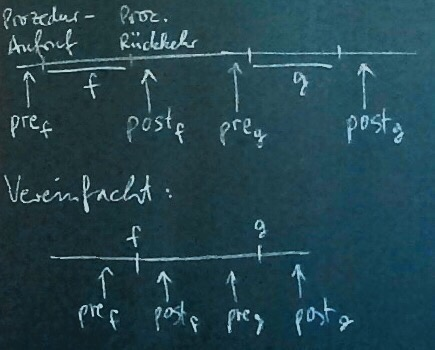

Problem bei Nebeneinander-Ablauf:

	               ↙ Wie verhält sich das System hier?
	––––––|––––––––-|––––––
	       --- f |--|
	       ––––––|––––––––-|––––––
	              --- g ---

Prozedur-Ausführungen können sich überlappen! Die Ausführung von f und die Ausführung von g können sich über gemeinsame Objekte gegenseitig beeinflussen!

Fazit: Das Verhalten einer Prozedur f ist durch pre\_{f} und post\_{f} nicht mehr genau genug beschreibbar.

	    Aktionen
	 ↙   ↓   ↓   ↘
	–|–––|–––|–––|–
	↑  ↑   ↑   ↑  ↑
	Zusicherungenüber die Zustände

Vereinfachungsmöglichkeiten:

- Aktionen, die keine gemeinsamen Objekte betreffen, können zusammengefasst werden zu einer Aktion
- Kritische Bereiche können zusammengefasst werden zu einer Aktion

**Sicherheitseigenschaft (auch Konsistenz, Invariante, engl. safety property)** := Eigenschaft, die für jeden Zustand gelten soll, und die sich nur auf vergangene Zustände bezieht.

**Liveness-Eigenschaft (auch: Fortschritt, engl. liveness property)** := alle übrigen Eigenschaften von Abläufen

Grund für die Unterscheidung:

1. Sicherheitseigenschaften sind einfach zu beweisen.
2. Die meisten Eigenschaften sind Sicherheitseigenschaften.

Intuitiv:  
Eine Sicherheitseigenschaft garantiert, dass nichts unerwünschtes geschieht („Verbot“). Eine Liveness-Eigenschaft garantiert, dass schließlich etwas Erwünschtes geschieht („Versprechen“). Ein Thread, der nur wartet, erfüllt alle Sicherheitseigenschaften. „Wer schläft, sündigt nicht.“

Bemerkung:  
Zu sequentiellen Programmen ist partielle Korrektheit eine Sicherheitseigenschaft und Termination eine Liveness-Eigenschaft.

Beweismethode für eine Sicherheitseigenschaft „Für jeden Zustand gilt S“.

1. S gilt für den Startzustand.
2. S bleibt bei jedem Zustandsübergang erhalten, das heißt, wenn S im alten Zustand gilt, dann auch im neuen Zustand.

Variante:

1. S gilt nach Initialisierung.
2. S bleibt außerhalb von kritischen Bereichen erhalten.
3. Wenn S beim Betreten eines kritischen Bereiches gilt, dann auch beim Verlassen.

Sperren sollen folgende Eigenschaften erfüllen:

1. **Gegenseitiger Ausschluss:**  Die kritischen Bereiche zweier Threads überlagern sich nicht.  
	Sicherheitseigenschaft: „In jedem Zustand ist verboten, dass zwei Threads im kritischen Bereich sind.“
2. **Verklemmungsfreiheit:** Wenn ein Thread die Sperre erwerben möchte, dann gibt es einen Thread, der die Sperre bekommt.  
	Liveness-Eigenschaft: „Wenn die Sperre zugeteilt werden soll, wird sie schließlich zugeteilt.“
3. **Fairness (auch: kein Verhungern):**  
	Jeder Thread, der eine Sperre erwerben möchte, bekommt sie schließlich auch. Liveness-Eigenschaft.

Es gilt: Aus Fairness folgt Verklemmungsfreiheit. Bedingungen für Prozeduraufrufe im Zusammenhang mit nebeneinander laufenden Threads:

1. **Bounden wait-free:**  
	Jeder Prozeduraufruf terminiert nach einer beschränkten Anzahl von Schritten.
2. **Wait-free:**  
	Jeder Prozessaufruf terminiert, das heißt er bleibt nicht in einer Warteschleife hängen.
3. **Lock-free:**  
	Unendlich viele Aufrufe terminieren.

### 2.5. Modellierung:
Ausdrucksformen für Sicherheits- und Liveness-Eigenschaften:

- Formale Sprachen, insbesondere reguläre Ausdrücke
- Prozessalgebra
- Temporale Logik: linear oder verzweigend
- Prädikatenlogik mit Abläufen als Objekten

**Beispiel:** Modellierung von Sperren.  
Aktionen:

- antᵢ: Thread i beantragt die Sperre
- belᵢ: Thread i belegt die Sperre
- frᵢ: Thread i gibt die Sperre wieder frei (verlässt den kritischen Bereich)


	Bel := {belᵢ | i ∈ I} (I ist die Menge der Threads)
Die Sperre wird belegt.

	Fr := {frᵢ | i ∈ I}
Die Sperre wird freigegeben.

Gegenseitiger Auschluss:

1. Mit regulären Ausdrücken  
	Für jeden Ablauf x gilt: Für jedes endliche Anfangsstück y von x gilt: Die Projektion von y auf die Aktionsmenge Bel ∪ Fr ist in der Sprache (Bel Fr)\* (Bel + ε) = PRE[^9]((Bel Fr)\*)
		Sei Ant := {antᵢ | i ∈ I} und A := Ant ∪ Bel ∪ Fr.
	Dann kann man gegenseitigen Ausschluss als Formel angeben:  
	∀ x ∈ A^{∞}: ∀ y ≤\_{pre} x:  
	\#\_{y} \< ∞ ⇒ π\_{Bel ∪ Fr(y)} ∈ PRE((Bel Fr)\*)  
	Ausgeschlossen ist z.B. der Ablauf „bel₁ bel₁ fr₂“  
	Präfix-Abschluss ist definiert durch  
	PRE(x) = {y ∈ A\* | y ≤\_{pre} X}

Formel für gegenseitigen Ausschluss kompakter:  
π\_{Bel ∪ Fr}(PRE(x)) ⊆ PRE((Bel Fr)\*)  
Zugelassen ist zum Beispiel der Ablauf bel₁ fr₂ ant₁.  
Ausgeschlossen ist zum Beispiel bel₁ bel₁ fr₂.  
Falls y ≤\_{pre} x und x ∈ X, dann y ∈ PRE(X).  
x ⊆ A\* ist *abgeschlossen unter Präfix*, falls PRE(x) ⊆ x. Es gilt: PRE(X) ist abgeschlossen unter Präfixen.

Gegenseitiger Ausschluss mit Formeln der Prädikatenlogik:  
∀ y ∈ PRE(x) ∩ A\* : 0 ≤ \#\_{Bel} y - \#\_{Fr} y ≤ 1

	#_{Bel} y - #_{Fr} y | Bedeutung
	––––––––––––––––––––––––––––––––
	          0          |   frei
	          1          |  belegt

∀ i ∈ N: Belⁱ\_{x} ≤ Frⁱ\_{x} ≤ Belⁱ⁺¹\_{x}  
∀ k, l ∈ N. frᵏ\_{i x} \< belˡ\_{j x} ∨ frˡ\_{j x} \< belᵏ\_{i x}

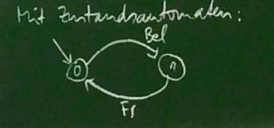

#### Lineare Temporale Logik
Hier: Lineare Temporale **Aussagen**logik.  
Syntax: Formeln sind aufgebaut mit

- true, false
- Variablen
- Verknüpfungen ∧, ∨, ¬ (weitere Verknüpfungen können damit definiert werden, z.B. ⇒, ⇔, ⊗. Endliche Quantoren
	
	mit M endlich.)
- temporale Operatoren
	- ◯
		- „next“
		- „im nächsten Zustand gilt“
	- ☐
		- „always“
		- „in allen zukünftigen Zuständen gilt“
	- ♢
		- „eventually“
		- „in mindestens einem zukünftigen Zustand gilt“

Beispiel: „Wer A sagt, muss auch B sagen.“  
☐ (A ⇒ ♢ B)

„Never change a running system.“  
☐ (R ⇒ ☐ R)  
gleichwertig: ☐ (R ⇒ ◯ R)

Semantik:

- 𝜎 sei ein serieller Ablauf
- j sei eine natürliche Zahl
- p sein eine temporal-logische Formel

(𝜎, j) ⊨ p  
„Formel p gilt an Position j des Ablaufs 𝜎.“  
Das wird rekursiv definiert durch:  
(𝜎, j) ⊨ p ∧ q : ⇔ (𝜎, j) ⊨ q  
usw.

(𝜎, j) ⊨ ◯ p : ⇔ (𝜎, j + 1) ⊨ p  
(𝜎, j) ⊨ ☐ p : ⇔ ∀ k ≥ j: (𝜎, k) ⊨ p
(𝜎, j) ⊨ ♢ p : ⇔ ∃ k ≥ j: (𝜎, k) ⊨ p

Gegenseitiger Ausschluss mit temporal-logischen Formeln:  
Beispiel:  
z\_{x} : ⇔ 0 ≤ \#\_{Bel} x - \#\_{Fr} x ≤ 1  
☐ z

Kein Verhungern:  
beant\_{i x} : ⇔ \#\_{antᵢ} x \> \#\_{belᵢ} x  
„Thread i hat die Sperre beantragt, aber noch nicht belegt.“

a\_{x} soll bedeuten:  
Aktion a ist im Zustand x soeben ausgeführt worden.

Semantik dazu:  
(𝜎, j) ⊨ a : ⇔ 𝜎(j) = a
  
☐ (beantᵢ ⇒ ♢ belᵢ)

## 3. Synchronisation
### 3.1. Signale
**Synchronisation (hier)** := dafür sorgen, dass gewisse Abläufe ausgeschlossen sind.  
Auch: Koordination.  
**Signal (auch: Handshake, Meldung, engl. notification)** := Hinweis an einen anderen Thread, dass er weitermachen kann.

Analogie:

- Startschuss beim Wettlauf
- Staffel beim Staffellauf
- Anschlusszug mus warten
- Becher vor Kaffeezulauf

Ein Signal kann durch eine Sperre implementiert werden:

- signalisieren (auch: melden) = freigeben
- warten = belegen

Das Signal soll garantieren, dass eine gewisse Reihenfolge eingehalten wird.

p₁: S₁;  
freigeben(l);

p₂: belegen(l);  
S₂;

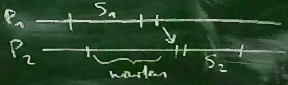

l muss freigegeben worden sein, bevor es wieder belegt werden kann, also findet S₁ vor S₂ statt:

Durch die Verwendung von Signal wird schränkt man die Menge der Abläufe ein. Nachteil: weniger Parallelität.  
Extremfall: Nur noch eine Reihenfolge möglich, der Abauf wird seriell. Abgesehen vom Koordinationsaufwand zu einem seriellen Programm gleichwertig.

### 3.2. Beispiel: Erzeuger/Verbraucher-Problem, 1. Version
Erzeuger und Verbraucher sind Threads. Der Erzeuger erzeugt Datenblöcke. Der Verbraucher holt die Datenblöcke ab und verarbeitet sie.  
Die erzeugten aber noch nicht verbrauchten Datenblöcke werden in einem Puffer (:= Warteschlange) zwischengespeichert.

##### 1. Version:
1 Erzeuger  
1 Verbraucher  
Puffer für 1 Datenblock

	Thread erz:
		Wiederhole
			herstellen(datenblock);
			einreihen(puffer, datenblock);
	
	Thread verb:
		Wiederhole
			abholen(puffer, datenblock);
			verarbeiten(datenblock);

Prozedur `einreihen(puffer, datenblock)`:  
① `belegen(leer);`  
② `kopieren(datenblock; puffer);` (kopiert Datenblock in Puffer)  
③ `freigeben(voll);`

Prozedur `abholen(puffer, datenblock)`:  
④ `belegen(voll);`  
⑤ `kopieren(puffer, datenblock);` (kopiert Puffer in Datenblock)  
⑥ `freigeben(leer);`

Hauptprogramm (HP):

	Sperre voll anlegen; // als belegt
	Sperre leer anlegen; // als belegt
	Threads erz und verb anlegen und laufen lassen;

⓪ `freigeben(leer);`

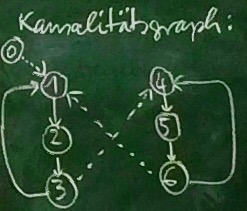

—\> Programm-Reihenfolge  
--\> Reihenfolge erzwungen durch Signal

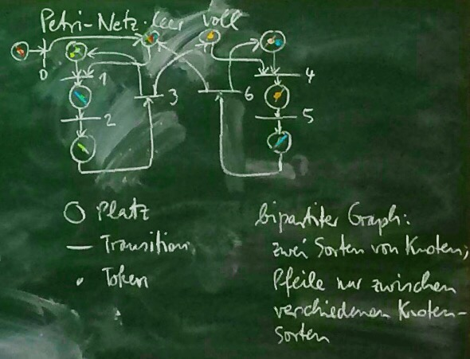

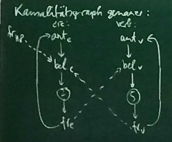

Ereignis e₁ *ist kausal für* Ereignis e₂: ⇔  
In jedem Ablauf gilt: Wenn e₂ stattfindet, dann hat e₁ vorher stattgefunden.  
Mit anderen Worten: e₂ kann erst stattfinden, wenn e₁ vorher stattgefunden hat.

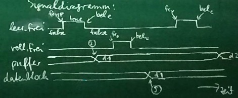

Verwendung der Sperren voll und leer bewirkt hier:

1. ② und ⑤ werden als kritische Bereiche behandelt.
2. ② und ⑤ werden nur abwechselnd ausgeführt.

Zu 1.: Gegenseitiger Ausschluss gilt. ¬leer.frei ∨ ¬voll.frei ist Invariante.  
Zu 2.: Folgt aus Programmreihenfolge und 1.

### 3.3. Semaphore
**Semaphor** := Datenstruktur l mit Zustand l.frei ∈ N₀ und Operationen „belegen“ und „freigeben“.

Sperre ist Spezialfall mit l.frei ∈ {0, 1}.

belegen(l): Wendet bis l.frei \> 0 und setzt dann l.frei auf l.frei - 1.  
freigeben)l): Setzt l.frei auf l.frei + 1.

Zweck: l.frei verschiedene Kopien eines Betriebsmittels werden verwaltet.

Zusammenhang zu Klammerausdrücken:

- „(“ bedeutet „freigeben(l)“
- „)“ bedeutet „belegen(l)“
- l.frei = Anzahl der noch offenen Klammern

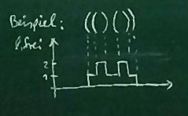

### 3.4. Erzeuger/Verbraucher-Problem, 2. Version
2. Version: 1 Erzeuger, 1 Verbraucher, N Datenblöcke mit N \> 0 beliebig.

Threads erz und verb wie in Version 1.

	Prozedur einreihen(puffer, datenblock):
		belegen(nichtvoll); // *I' gilt*
		stock(puffer, datenblock);
		// ↑ Anfügen des Datenblocks am Puffer hinten
		freigeben(nichtleer); // *I gilt*

	Prozedur abholen(puffer, datenblock):
		belegen(nichtleer); // *I' gilt*
		datenblock := top(puffer);
		// ↑ liefert vordersten Datenblock des Puffers
		pop(puffer);
		freigeben(nichtvoll); *I gilt*

Hauptprogramm:

- Leeren Puffer anlegen
- Semaphore nichtvoll und nichtleer erzeugen mit nichtvoll.frei = 0 und nichtleer.frei = 0.
- Threads erz und verb anlegen und laufen lassen.
		freigebenᴺ(nichtvoll);
		// nichtvoll wird N-mal freigegeben, *I gilt*

Invariante *I*: 0 ≤ nichtvoll.frei ≤ N ∧ nichtleer.frei + nichtvoll.frei ≤ *N*  
Invariante *I'*: 0 ≤ nichtvoll.frei ≤ N ∧ nichtleer.frei + nichtvoll.frei ≤ *N - 1*  
Invariante *I"*: 0 ≤ nichtvoll.frei ≤ N ∧ nichtleer.frei + nichtvoll.frei ≤ *N - 2*

*I" gilt, wenn beide Threads belegen aufgerufen haben, aber noch nicht freigeben aufgerufen haben.*

### 3.5. Bedingte Kritische Bereiche
Ein kritischer Bereich soll nur betreten werden, wenn eine gewisse Bedingung B an die gemeinsame Variable gilt. Wie implementiert man das?

1. B vor dem Betreten des kritischen Bereiches überprüfen.  
	Problem: B kann beim Betreten des kritischen Bereiches bereits wieder verletzt sein.
2. B im kritischen Bereich überprüfen.  
	Problem: Solange B nicht gilt, soll der Thread warten.  
	Weil er sich im kritischen Bereich befindet, können andere Threads die gemeinsame Variable nicht ändern, und damit den Wert von B.

Mit kritischen Bereichen kann man das Problem nicht lösen.  
Abhilfe: neues Konstrukt.

Warteanweisung:

	warte auf B;

B := Bedingung an gemeinsame Variable (bewacht von Sperre l)

Beispiel-Implementierung:

	Solange ¬B wiederhole
		freigeben(l);
		belegen(l);

Warteanweisung steht im kritischen Bereich:

	kritisch l {
		⋮
		warte auf B;
		⋮
	}

Implementierung bedingter kritischer Bereiche in Java: „Bedingungsvariable“

Typ Condition  
Bedingungsvariable wird einer Sperre zugeordnet.  
Z.B.

	Lock l = new ReentrantLock();
	Condition c = new Condition(l); // <- Bedingte Variable c ist der Sperre l zugeordnet

Werteanweisung: `wait(c);`  
Signalisieren: `signal(c);` oder `signalAll(c);`  
Empfohlen ist `signalAll(c)`  
Warteanweisung soll implementiert werde durch:

	while (¬B) { // Bedingte Variable c „vertritt“ die Bedingung B.
		wait(c); // Signal an c bedeutet:
	}            // „Bedingung B könnte erfüllt sein“

Keine Garantie!

### 3.6. Erzeuger/Verbraucher-Problem, 3. Version
Beliebig viele Erzeuger, beliebig viele Verbraucher, Puffer mit N Datenblöcken.

	einreihen(puffer, datenblock):
		kritisch l {
			warte auf länge(puffer) < N;
			stock(puffer, datenblock);
		}
	
	abholen(puffer, datenblock):
		kritisch l {
			warte auf länge(puffer) > 0;
			datenblock := top(puffer);
			pop(puffer);
		}
	
	// länge(puffer) liefert die Anzahl der Datenblöcke,
	// die sich gerade im Puffer befinden
	
	Hauptprogramm:
		Erzeugen des Puffers; Puffer ist leer.
		Erzeugen der Sperre l für den Puffer.
		Erzeugen der Threads und Starten der Threads.
	
	// Version mit Bedingungsvariablen:
	einreihen(puffer, datenblock):
		belegen(l);
		solange länge(puffer) < N wiederhole:
			wait(nichtvoll);
		stock(puffer, datenblock);
		signalAll(nichtleer);
		falls länge(puffer) < N, dann:
			signalAll(nichtvoll);
		freigeben(l);
	
	abholen(puffer, datenblock):
		belegen(l);
		solange länge(puffer) > 0 wiederhole:
			wait(nichtleer);
		datenblock := top(puffer);
		pop(puffer);
		signalAll(nichtvoll);
		falls länge(puffer) > 0, dann:
			signalAll(nichtleer);
		freigeben(l);

### 3.7. Wiederbetretbare Sperre
**Wiederbetretbare Sperre (engl. reentrant lock)** := Ein Thread darf die Sperre mehrfach erwerben  
Zweck: Innerhalb eines kritischen Bereiches darf man eine Prozedur aufrufen, die wieder einen kritischen Bereich für dieselbe gemeinsame Variable enthält. Bequemere Programmierung.  
Die innereren kritischen Bereiche sollen dazu wirkungslos sein.

###### Beispiel:
	        belegen(l);
	¯¯¯¯¯¯¯ S1;
	|krit.  belegen(l);		↖
	|Be-    S2;					wirkungslos
	|reich  freigeben(l);	↙
	_______ S3;
	        freigeben(l);

Bemerkung: Wiederbetretbare Sperren und Semaphore sind inkompatibel zueinander.

### 3.8. Leser/Schreiber-Problem
Mehrere Threads greifen lesend oder schreibend auf eine gemeinsame Variable zu (Courtois und andere 1971).  
Mehrere Threads können lesend auf die gemeinsame Variable zugreifen, ohne sich gegenseitig zu stören.

##### Lese/Schreib-Konflikt:
Eine gemeinsame Variable darf nicht gleichzeitig gelesen und geschrieben werden.

##### Schreib/Schreib-Konflikt:
Eine gemeinsame Variable darf nicht von mehreren Threads gleichzeitig geschrieben werden.

2 Varianten:

1. Ein Leser muss nur dann warten, wenn gerade ein Schreiber aktiv ist: Leser haben Vorrang.
2. Ein Schreiber muss nur auf Leser und Schreiber warten, die gerade aktiv sind: Schreiber haben Vorrang.

Wenn 1 und 2 abwechselnd verwendet werden, bekommt man Fairness.

```
	         |       Leser
	–––––––––+––––––––––––––––––––––	i. O.:	„in Ordnung“
	 Schrei- |     |   0   |  > 1  |
	 ber     |––––––––––––––––––––––	LS:	Lese/Schreib-Konflikt
	         |  0  | i. O. | i. O.
	         |  1  | i. O. |  LS		SS:	Schreib/Schreib-Konflikt
	         | ≥ 2 |  SS   | LS + SS
```

## 4. Implementierung
### 4.1. Atomare Maschinenbefehle
Wie werden Sperren implementiert?

###### Naiver Versuch:
	belegen(l):
		Solange ¬l.frei gilt, wiederhole:
			Warte einen augenblick;
		Setze l.frei = false.

Beispielablauf für 2 Threads, die versuchen, belegen(l) aufzurufen. Sei zu Beginn l.frei = true.

```
	  P₁  P₂  |  l.frei
	––––––––––+–––––––––
	  1       |
	      1   |
	  3       |
	      3   |
```

Beide Threads sind im kritischen Bereich!
⇒ 1, 2, 3 muss selber wieder ein kritischer Bereich sein.

Man benötigt einen speziellen Maschinenbefehl, z.B.

	getAndSet(c, b, v):
		b := c;
		c := v;

Zwei Ausführungen dieses Maschienenbefehls müssen immer unter gegenseitigem Ausschluss stattfinden, das heißt der Maschinenbefehl muss atomar sein. Die Hardware muss dafür sorgen („Arbitisierung“).

Implementierung mit `getAndSet`:

	belegen(l):
		boolean b;
		getAndSet(l.frei, b, false);
		Solange ¬b wiederhole:
			Warte einen Augenblick;
			getAndSet(l.frei, b, false);
	
	freigeben(l):
		boolean b;
		getAndSet(l.frei, b, true);

Alternativen:

	getAndInc(c, b):
		b := c;
		c := c + 1;
	
	getAndDec(c, b):
		b := c;
		c := c - 1;
	
	compareAndSet(c, e, v, b);
		Falls c = e, dann	}
			c := v;			} b := Wahrheitswert
			b := true;		} von „c = e“;
		Sonst:				} Falls b, dann c := v;
			b := false;		}

Befehl CMPXCHG auf Intel Pentium.  
Implementierung mit compareAndSet:

	belegen(l):
		boolean b;
		compareAndSet(l.frei, true, false, b);
		Solange ¬b wiederhole:
			Warte einen Augenblick;
			compareAndSet(l.frei, true, false, b);
	
	freigeben(l):
		boolean b;
		compareAndSet(l.frei, false, true, b);

Volatile (engl. für „flüchtig“) Schlüsselwort in Java.  
Beispiel: `volatile int x;`  
x ist damit als gemeinsame Variable gekennzeichnet. Übliche Optimierungen des Compilers für lokale Variable sind ausgeschlossen.  
Lese- und Schreibzugriffe auf x sind zueinander atomar (schließen sich gegenseitig aus): „atomares Register“. Die Hardware sorgt für Atomarität.

### 4.2. Konsenzzahlen
Konsensproblem:

1. im Hauptprogramm:
		init(c);
	Gemeinsame Variable c wird initialisiert.
2. Jeder Thread ruft höchstens ein Mal `entscheide(c, v, a)` auf. (c: gemeinsame Variable, v: Vorschlag vom Typ T, a: Variable vom Typ T)
3. Der Aufruf entscheide(c, v, a) gibt an a einen Wert mit folgenden Eigenschaften:
	- Einigkeit: Jeder Thread bekommt denselben Wert in a.
	- Gültigkeit: Der Wert in a wurde von mindestens einem Thread vorgeschlagen.

**n-Konsensproblem** := Konsensproblem mit n beteiligten Threads

Es gilt:

- Mit dem n-Konsensproblem löst man auch das k-Konsensproblem für jedes k \< n.
- Das 1-Konsensproblem ist trivial lösbar: `a := v` implementiert `entscheide(c, v, a)`.

Die Konsenszahl für eine Klasse (Sprache) K ist definiert als

	{ ∞, falls K das n-Konsensproblem für alle n ∈ N löst
	{ n, falls n ∈ N maximal sodass K das n-Konsensproblem löst

###### Satz: (Herlihy, 1991)
```
	       Klasse K       | Konsenszahl K(K)
	––––––––––––––––––––––+–––––––––––––––––
	   atomare Register   |        1
	    Warteschlangen    |        2
	 Common-2-Operationen |        2
	    compareAndSet     |        ∞
```
n-Konsens mit `compareAndSet` und `get`: (Einfaches Konsensproblem: Jeder schlägt sich selbst vor)

	init(c):
		Setze c = -1;
	
	entscheide(c, i, a): // i: Thread-ID des Aufrufers
		boolean b;
		compareAndSet(c, -1, i, b);
		Falls b gilt, dann:		}
			a := i;				} Genauso gut:
		Sonst					} a := get(c);
		a := get(c);			}

Read/Modify/Write-Operation:

	// c: gem. Variable mit Wert vom Typ T
	// b: Ergebnisvariable vom Typ T
	// f: Modifikationsfunktion f: T → T
	rmw(c, b, f):
		b := c;
		c := f(c);

Es gilt:

	getAndSet(c, b, v) = rmw(c, b, λx.v);
	getAndInc(c, b) = rmw(c, b, λx.x + 1);

> Schar F von Funktionen von T nach T heißt *Common 2*, falls  
> `f(g(x)) = f(x)` oder  
> `g(f(x)) = g(x)` oder  
> `f(g(x)) = g (f(x))`  
> für alle f, g ∈ F, x ∈ T. (Trivial für f = g).

F heißt *nicht-trivial*, falls F ≠ {id} und F ist nicht leer, das heißt F \\{id} ≠ Ø.

Beispiel:
	F = \{λx.x + 1, λx.x - 1}
	      ⎝   s   ⎠⎝   P   ⎠

Es gilt: `s(p(x)) = x = p(s(x))` für alle x ∈ Z. Also ist F Common 2. Damit Konsenszahl ≤ 2. Da F nicht-trivial, ist Konsenszahl = 2.

### 4.3. Zwischenspeicher
**Zwischenspeicher (ZSP), engl. cache)** := schneller, kleiner Speicher auf dem Prozessorchip

Bemerkung: Herkunft des Begriffs „cache“: Versteck der Beute eines Einbrechers.

Verwendung: Nachdem der Prozessor das erste Mal auf eine gewisse Arbeitsspeicherzelle lesend zugegriffen hat, speichert er den Wert in seinem Zwischenspeicher. Wenn er das nächste Mal lesend auf dieselbe Adresse zugreifen will, findet er das Ergebnis in seinem Zwischenspeicher („Treffer“). Er braucht dazu nicht auf den Bus zuzugreifen.  
Um schreibend auf eine Arbeitsspeicherzelle zuzugreifen, speichert der Prozessor das Wort zunächst in seinem Zwischenspeicher. Nur wenn ein anderer Prozessor auf dieselbe Speicherzelle lesend zugreifen will, muss das Wort in den Arbeitsspeicher geschrieben werden.

Vorteil des Zwischenspeichers:  
Weniger Zugriffe auf den Arbeitsspeicher nötig, damit schneller und der Bus ist weniger belastet.  
Der Zwischenspeicher lohnt sich, wenn im Programm häufig dicht hintereinander Zugriffe auf dieselbe Adresse vorkommen („Lokalität“).

Um den Verwaltungsaufwand gering zu halten, ist der Zwischenspeicher in sogenannten *Speicherzeilen* (engl. cache lines) organisiert.  
Sobald der Zwischenspeicher voll ist, wird es nötig, manche Zeilen *auszuwerfen* (engl. to evict), um Platz zu schaffen.

**Kohärenz** := Jeder Lesezugriff auf den Zwischenspeicher liefert den zuletzt geschriebenen Wert.

Kohärenz bedeutet praktisch, dass sich durch die Einführung des Zwischenspeichers nichts am Verhalten des Systems ändert.  
Um Kohärenz zu erreichen, verwendet man ein Kohärenz-Protokoll, z.B. das MESI-Protokoll.

###### MESI-Protokoll:
Jede Speicherzelle hat einen Modus:
- Modified: Zeile wurde verändert. Kein anderer Prozessor hat diese Zeile in seinem Zwischenspeicher.
- Exclusive: Zeile ist unverändert. Kein anderer Prozessor hat diese Zeile in seinem Zwischenspeicher.
- Shared: Zeile ist unverändert. Andere Prozessoren können diese Zeile in ihrem Zwischenspeicher haben.
- Invalid: Zeile enthält keine verwertbaren Daten.[^10]

Beispiel-Ablauf:  
A, B, C seien Prozessoren,  
M sei ein Arbeitsspeicherblock

	    A        B        C        M
	  –––––    –––––    –––––    –––––
	E | a |    |   |    |   |    | a |
	  –––––    –––––    –––––    –––––
	____|________|________|________|

A liest von Adresse a.

	    A        B        C        M
	  –––––    –––––    –––––    –––––
	S | a |  S | a |    |   |    | a |
	  –––––    –––––    –––––    –––––
	____|________|________|________|

B liest von Adresse a,  
A antwortet.

	              ↙ veränderte Zeile
		A        B        C        M
	  –––––    –––––    –––––    –––––
	I | a |  M | a |    |   |    | a |
	  –––––    –––––    –––––    –––––
	____|________|________|________|

B schreibt auf Adresse a und informiert alle darüber.

	    A        B        C        M
	  –––––    –––––    –––––    –––––
	S | a |  S | a |    |   |    | a |
	  –––––    –––––    –––––    –––––
	____|________|________|________|

A liest von Adresse a, das führt zu einer Anfrage an alle.  
B sendet die veränderten Daten an A und an M.

**False Sharing** := gemeinsame Speicherzeile, obwohl sich die Daten darin nicht überlappen

Im Zwischenspeicher von B:

	|_____|█████|	Speicherzelle für Adresse a
	          ↖ verändertes Wort

Im Zwischenspeicher von A:

	|_____|_____|
	    ↖ Wort ist noch aktuell

Lesezugriff von A auf dieses Wort ist eigentlich in Ordnung.

False Sharing führt unnötig häufig zu Modus I. Daten, die nebeneinander verwendet werden, sollten in verschiedenen Speicherzeilen liegen.

Verhalten mit `getAndSet`:

	getAndSet(c, b, true)

Dabei ausgeführte Aktionen:
1. c lesen
2. b schreiben
3. c schreiben

	    A        B        C        M
	  –––––    –––––    –––––    –––––
	S | c |  S | a |  S | c |    | c |
	  –––––    –––––    –––––    –––––
	____|________|________|________|

Zustand vorher

	    A        B        C        M
	  –––––    –––––    –––––    –––––
	S | c |  S | a |  S | c |    | c |
	  –––––    –––––    –––––    –––––
	____|________|________|________|

A führt 1. aus.  
Wert von c im Zwischenspeicher von A ist bereits aktuell; keine Änderung.

	    A        B        C        M
	  –––––    –––––    –––––    –––––
	S | c |  S | c |  S | c |    | c |
	M | b |    |   |    |   |    |   |
	  –––––    –––––    –––––    –––––
	____|________|________|________|

A führt 2. aus.

	    A        B        C        M
	  –––––    –––––    –––––    –––––
	M | c'|  I | c |  I | c |    | c |
	M | b |    |   |    |   |    |   |
	  –––––    –––––    –––––    –––––
	____|________|________|________|

A führt 3. aus.

	    A        B        C        M
	  –––––    –––––    –––––    –––––
	S | c'|  S | c'|  S | c'|    | c'|
	  –––––    –––––    –––––    –––––
	____|________|________|________|

B führt 1. aus.

	    A        B        C        M
	  –––––    –––––    –––––    –––––
	S | c'|  S | c'|  S | c'|    | c'|
	M | b |  M | b |    |   |    |   |
	  –––––    –––––    –––––    –––––
	____|________|________|________|

B führt 2 aus.

	    A        B        C        M
	  –––––    –––––    –––––    –––––
	S | c'|  S | c'|  S | c'|    | c'|
	M | b |  M | b |    |   |    |   |
	  –––––    –––––    –––––    –––––
	____|________|________|________|

B führt 3. aus. Keine Änderung, denn der Wert in c verändert sich nicht dabei.

Alle `getAndSet`-Aufrufe der Warteschleife können ohne Bus-Zugriff abgearbeitet werden.

### 4.4. Bäckerei-Algorithmus
Bäckerei-Algorithmus (engl. bakery algorithm): von Leslie Lamport 1974 publiziert; Implementierung von Sperren mit atomaren Registern.

Analogie: Jeder, der (in Amerika) eine Bäckerei betritt, zieht zuerst eine laufende Nummer. Der Kunde mit der nächsten Nummer wird als nächster bedient.

Pseudocode mit einer Sperre:

	Typ Thread ID = {0, …, n - 1}; // (n Threads)
	
	// Zustand der Sperre
	volatile flag: boolean[ThreadID]; // init. mit false-Werten
	volatile label: long[ThreadID]; // init. mit 0-Werten
	
	Prozedur belegen():
		int i := Nummer des aufrufenden Threads;
		flag[i] := true;
		label[i] := max{label[0], …, label[n - 1]} + 1;
		Warte solange ∃k ≠ 1: flag[k] ∧
		(label[k], k) <_{lex} (label[i], i).
	
	Prozedur freigeben():
		flag[Nummer des aufrufenden Threads] := false;

##### Behauptung:
Der Bäckerei-Algorithmus hat die Fortschritteigenschaft.

##### Beweis:
Der Thread i mit dem kleinsten Paar (label[i], i) wartet nicht. Es gibt so ein i, denn \<\_{lex} ist eine Wohlordnung. Damit hat jede nicht-leere Menge ein kleinstes Element.

##### Behauptung:
Der Bäckerei-Algorithmus ist FCFS[^11].

##### Beweis:
Falls Thread i den Torweg verlässt, bevor Thread j ihn betritt, dann gilt:

	w_{i}(label[i], v) →
	r_{j}(label[i], v) →
	w_{j}(label[j], v')		mit v < v'
	r_{j}(label[i], true)

Dabei bedeutet `w_{i}(label[i], v)`:  
Schreibzugriff von Thread i auf die Variable label[i]; der geschriebene Wert ist v.  
Es gilt flag[i] ∧ (label[i], i) \<\_{lex}(label[j], j).  
Also wartet Thread h auf Thread i.

Aus Fortschritteigenschaft und FCFS folgt Fairness.

##### Behauptung:
Der Bäckerei-Algorithmus erfüllt gegenseitigen Ausschluss.

##### Beweis:
Durch Widerspruch.  
Angenommen, Threads i und j sind nebeneinander im kritischen Bereich.  
OBdA[^12] gilt (label[i], i) \<\_{lex}(label[j], j).  
Sobald Thread j die Warteschleife verlassen hat, gilt  
**(1)** `flag[i] = false` oder  
**(2)** `(label[j], j) <_{lex} (label[i], i)`.

Die Werte i und j sind fest. Der Wert von label[j] ändert sich nicht mehr bis zum Betreten des kritischen Bereichs. Der Wert von label[i] kann höchstens größer werden. Wenn also **(2)** beim Verlassen der Warteschleife gilt, dann auch im kritischen Bereich. Widerspruch!
Also gilt **(1)**. Deswegen

	r_{j}(label[i], _) → // gelesener Wert ist irrelevant
	w_{j}(label[j], v) →
	r_{j}(flag[i], false) →
	w_{i}(flag[i], true) →
	r_{i}(label[j], v) →
	w_{i}(label[i], v') →

mit v \< v’, also label[j] \< label[i]. Widerspruch!

### 5.4. Implementierung mit Fauler Synchronisation
Listenelemente bekommen ein neues Attribut „marked“ (zum Löschen markiert)

Neue Version von `validate`:

	private boolean validate(Node<T> pred, Node<T> curr) {
		return !pred.marked && !curr.marked && pred.next == curr;
	}

Löschen:

	public boolean remove(T item) {
		int k = item.hashCode();
		boolean done = false;
		boolean erg = false;
		while (!done) {
			Node<T> pred = this.head;
			Node<T> curr = pred.next;
			while (curr.key < k) {
				pred = curr;
				curr = pred.next;
			}
			pred.lock();
			try {
				curr.lock();
				try {
					if (validate(pred, curr)) {
						if (curr.key == k) {
							curr.marked = true;
							pred.next = curr.next;
							erg = true;
						}
						done = true;
					}
				}
				finally {
					curr.unlock();
				}
			}
			finally {
				pred.unlock();
			}
		}
		return erg;
	}

## Seminare
### Aufgabe 1:
Es soll ein Java-Hauptprogramm geschrieben werden, in dem 8 Threads angelegt werden. Jeder Thread *i* soll auf dem Bildschirm ausgeben „Hello World from Thread *i*“.

##### Muster:
	import java.lang.threads.*;
	
	public static void main() {
		Thread[] threads = new Thread[8];
		for (int i = 0; i < 8; i++) {
			final int c = i;
			thread[i] = new Thread(
				new Runnable() {
					public void run() {
						System.out.println(
							"Hello World from Thread " + c
						);
					}
				}
			);
		}
		for (int i = 0; i < 8; i++) {
			thread[i].start();
		}
		for (int i = 0; i < 8; i++) {
			thread[i].join();
		}
	}

### Aufgabe 2:
1. Es soll ein Java-Hauptprogramm geschrieben werden, in dem eine globale Variable *z* auf 0 initialisiert wird und von jedem der 10000 Threads inkrementiert wird. Interpretieren Sie das Ergebnis.
2. Ersetzen Sie z++ durch den Aufruf einer Methode.

##### Muster 1:
	import java.lang.threads.*;
	
	static int z = 0;
	
	public static void main() {
		Thread[] threads = new Thread[8];
		for (int i = 0; i < 10000; i++) {
			final int c = i;
			thread[i] = new Thread(
				new Runnable() {
					public void run() {
						z++;
					}
				}
			);
		}
		for (int i = 0; i < 10000; i++) {
			thread[i].start();
		}
		for (int i = 0; i < 10000; i++) {
			thread[i].join();
		}
	}

##### Muster 2:
	import java.lang.threads.*;
	
	static int z = 0;
	
	public static void main() {
		Thread[] threads = new Thread[8];
		for (int i = 0; i < 10000; i++) {
			final int c = i;
			thread[i] = new Thread(
				new Runnable() {
					public void run() {
						inc();
					}
				}
			);
		}
		for (int i = 0; i < 10000; i++) {
			thread[i].start();
		}
		for (int i = 0; i < 10000; i++) {
			thread[i].join();
		}
	}
	synchronized static void inc() {
		z++;
	}

### Aufgabe: Amdahls Gesetz
1. Finden Sie heraus, welcher Anteil der Zähler-Aufgabe (mit k = 10000 Threads) parallelisierbar ist.
2. Welchen Anteil erwarten Sie für k = 20000 Threads?
3. Wie weit kann man die Bearbeitung durch Parallelisierung beschleunigen, wenn man beliebig viele Prozessoren zur Verfügung hat?

##### Lösung:
Parallelisierter Anteil: `p = ((b / a - 1) * n) / (1 - n)`  
a: serielle Bearbeitungszeit; b: parallele Bearbeitungszeit

Beschleunigung: `1 / (1 - p)`.

### Aufgabe: Verschränkung (1)
Thread p habe m Schritte, Thread q habe n Schritte auszuführen.

1. Geben Sie eine rekursive Definition an für die Anzahl anz(m, n) der möglichen verschränkten Abläufe von p und q.
2. Finden Sie einen geschlossenen Ausdruck für anz(m, n).
3. Schätzen Sie die Größenordnung von anz(n, n).

##### Lösung:
1. Formel:
		anz(m, n) = { 1, falls m = 0 oder n = 0
		            { anz(m - 1, n) + anz(m, n - 1), sonst
2. Wegbeschreibung = Bitvektor mit m Nullen und n Einsen  
	(0 ≙ 1 Schritt nach rechts, 1 ≙ 1 Schritt nach unten)
	Länge des Bitvektors ist m + n.
	Isomorph zu Bitvektor mit m Nullen und n Einsen sind n-Teilmengen einer (m+n)-Menge.
	Beispiel: Bitvektor `011010`
	(m+n)-Menge sei `{1, …, m + n}`.
	Dargestellte Teilmenge ist `{2, 3, 5}`.
	Satz: Die Anzahl der k-Teilmengen einer n-Menge ist *n über k* (Binomialkoeffizient).
	Es gilt `anz(m, n)` = `(m + n)` *über* `n`.
3. Behauptung: `anz(n, n)` = `2n` *über* `n` ≥ 2ⁿ - 1 für n ≥ 1.
	Beweis:
	1. n = 1: `anz(n, n)` = `2` *über* `1` = 2
	2. n \> 1: `anz(n, n)` = `2n` *über* `n` = `2n - 1` *über* `n` + `2n - 1` *über* `n - 1` ≥  
		`2ⁿ` = `2 * 2ⁿ⁻¹` ≤ `2 * 2 (n - 1)` *über* `n - 1` ≤  
		weil `2n - 1` *über* `n - 1` ≥ `2n - 2` *über* `n - 1` und `2n - 1` *über* `n` ≥ `2n - 2` *über* `n - 1`  
		`2n - 1` *über* `n - 1` = `2n - 2` *über* `n - 1` + `2n - 2` *über* `n - 2`

### Umgang mit Sperren in Java:
	package.…;
	import java.util.concurrent.locks.*;
	…
	private static Lock lock;
	…
	lock = new ReentrantLock();
	…
	lock.lock();
	try {
		… // kritischer Bereich
	}
	finally {
		lock.unlock();
	}

`lock.unlock` wird immer abschließend ausgeführt, auch wenn der try-Block eine Ausnahme auslöst.

### Aufgabe: Verschränkung (2)
n Threads sollen verschränkt zueinander laufen. Jeder Thread habe 2 Schritte auszuführen.

1. Geben Sie eine rekursive Definition an für die Anzahl anz\*(n) der möglichen Abläufe.
2. Finden Sie einen geschlossenen Ausdruck für anz\*(n).
3. Schätzen Sie die Größenordnung von anz\*(n).

##### Lösung:
1. Es gilt anz\*(1) = 1. Sei nun n \> 1. Nach IV liefert anz\*(n - 1) die Anzahl der möglichen Abläufe für n - 1 Threads.
	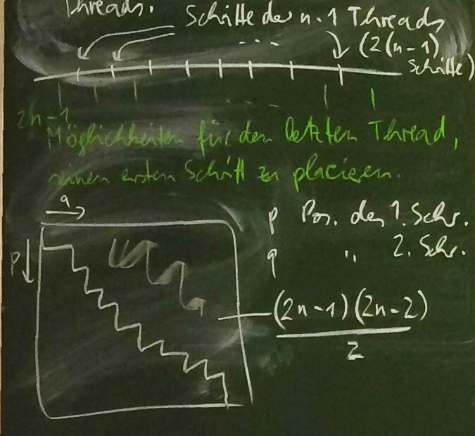
	Also gilt:

		anz*(n) = {1, falls n = 1,
		          {anz*(n-1) * (2n-1) * (n-1), sonst.

### Aufgabe: Zeitliche Abläufe
1. Geben Sie zu folgendem zeitlichen Ablauf den passenden seriellen Ablauf (Aktionenfolge) an:  
	{(a, 5.3), (b, 3.7), (c, 3.2), (a, 1.7), (a, 2.1), (b, 2.5)}.
	##### Lösung:
	{(a, 1.7), (a, 2.1), (b, 2.5), (c, 3.2), (b, 3.7), (a, 5.3)}

		f(x) = { a, falls x ∈ {1, 2, 6}
		       { b, falls x ∈ {3, 5}
		       { c, sonst

2. Welche der folgenden Mengen von Ereignissen sind diskrete zeitliche Abläufe? Dazu sei A = {a, b}.  
	⍺) {(a, -3), (a, 25), (b, 2)} **✓**  
	β) {a} ⨉ N **✓**  
	ɣ) {a} ⨉ Z⁻**✗** (kein kleinstes Element)  
	ƍ) {(a, 1 + (1/i) | i ∈ N} ∪ {(a, 0)} **✗** (Häufung bei t = 1  
	ε) {(a, 1 + (1/i) | i ∈ N, i \< 100} **✓**  
	ζ) {a, 3), (b, 5), (b, 3)} **✗** (verschiedene gleichzeitige Ereignisse)
3. Geben Sie zu jedem diskreten zeitlichen Ablauf aus Teilaufgabe 2 die Ereignisse E¹, E², E³ an.  
	⍺: E¹ = (a, - 3), E² = (b, 2), E³ = (a, 25).  
	β: E¹ = (a, 1), E² = (a, 2), E³ = (a, 3).  
	ε: E¹ = (a, 1 + (1/99)), E² = (a, 1 + (1/98)), E³ = (a, 1 + (1/97)).

### Aufgabe: Einigkeit
Beweisen Sie, dass für alle Threads p₁, p₂ folgende Aussagen äquivalent sind:  
⍺) π\_{A₁ ∩ A₂}(E₁ ∪ E₂) = E₁ ∩ E₂  
β) π\_{A₁ ∩ A₂}(E₁ ⊕ E₂) = Ø  
ɣ) π\_{A₁}(E₂) = π\_{A₂}(E₁)

Dabei sei Aᵢ das Prozessalphabet von Thread pᵢ und Eᵢ der zeitliche Ablauf von Thread pᵢ, i ∈ {1, 2}.  
Dann gilt: π\_{Aᵢ}(Eᵢ) = Eᵢ

##### Lösung
###### Zu zeigen: β ⟹ ⍺
π\_{A₁ ∩ A₂}(E₁ ∪ E₂) = π\_{A₁ ∩ A₂}((E₁ ⊕ E₂) ∪ (E₁ ∩ E₂))  
= π\_{A₁ ∩ A₂}(E₁ ⊕ E₂) ∪ π\_{A₁ ∩ A₂}(E₁ ∩ E₂)  
= Ø ∪ π\_{A₁ ∩ A₂}(E₁ ∩ E₂)  
= π\_{A₁}(π\_{A₂}(E₁ ∩ E₂))  
= π\_{A₁}(π\_{A₂}(E₁) ∩ π\_{A₂}(E₂))

###### Zu zeigen: ⍺ ⟹ β
π\_{A₁}(E₁ ⊕ E₂) = π\_{A₁ ∩ A₂}((E₁ ∪ E₂)\\(E₁ ∩ E₂))  
= π\_{A₁ ∩ A₂}(E₁ ∪ E₂)\\π\_{A₁ ∩ A₂(E₁ ∩ E₂)  
= (E₁ ∩ E₂)\\(E₁ ∩ E₂) = Ø

###### Zu zeigen: β ⟹ ɣ
π\_{A₁}(E₁) = π\_{A₂}(E₂)  
**(1)** π\_{A₁}(E₂)\\π\_{A₂}(E₁) = Ø ⟺ π\_{A₁}(E₂) ≤ π\_{A₂}(E₁)  
**(2)** π\_{A₂}(E₁)\\π\_{A₁}(E₂) = Ø ⟺ π\_{A₂}(E₁) ≤ π\_{A₁}(E₂)

**(1)** ∩ **(2)**  
⟺ π\_{A₁}(E₂)\\π\_{A₂}(E₁) ∪ π\_{A₂}(E₁)\\π\_{A₁}(E₂) = Ø  
⟺ π\_{A₁}(E₂) ⊕ π\_{A₂}(E₁) = Ø

Noch zu zeigen: π\_{A₁ ∩ A₂}(E₁ ⊕ E₂) = π\_{A₁}(E₂) ⊕ π\_{A₂}(E₁)  
π\_{A₁ ∩ A₂}(E₁ ⊕ E₂) = π\_{A₁}(π\_{A₂}(E₁ ⊕ E₂))  
= π\_{A₁}(π\_{A₂}(E₁) ⊕ π\_{A₂}(E₂))  
= π\_{A₁}(π\_{A₂}(E₁) ⊕ E₂)
= π\_{A₁}(π\_{A₂}(E₁)) ⊕ π\_{A₁}(E₂)  
= π\_{A₂}(π\_{A₁}(E₁)) ⊕ π\_{A₁}(E₂)  
= π\_{A₂}(E₁) ⊕ π\_{A₁}(E₂)

###### Zu zeigen: ɣ ⟹ β
π\_{A₁ ∩ A₂}(E₁ ⊕ E₂)  
= π\_{A₁ ∩ A₂}(E₁) ⊕ π\_{A₁ ∩ A₂}(E₂)  
= π\_{A₁ ∩ A₂}(E₁)\\π\_{A₁ ∩ A₂}(E₂) ∪ π\_{A₁ ∩ A₂}(E₂)\\π\_{A₁ ∩ A₂}(E₁) = Ø

Zu zeigen dazu:  
π\_{A₁ ∩ A₂}(E₁) = π\_{A₁ ∩ A₂}(E₂)  
π\_{A₂}(π\_{A₁}(E₁) = π\_{A₁}(π\_{A₂}(E₂)  
E₁ = E₂

###### Anderer Weg für ɣ ⟹ β
π\_{A₁ ∩ A₂}(E₁ ⊕ E₂) = π\_{A₁}(π\_{A₂}(E₁ ⊕ E₂))  
= π\_{A₁}(π\_{A₂}(E₁) ⊕ π\_{A₂}(E₂))  
= π\_{A₁}(π\_{A₁}(E₂) ⊕ E₂)  
= π\_{A₁}(E₂) ⊕ π\_{A₁}(E₂) = Ø

### Aufgabe:
1. Beweisen Sie, dass „→“ eine Wohlordnung (das heißt irreflexiv, transitiv, total, fundiert) ist.
	##### Lösung
	- irreflexiv: Beweis durch Widerspruch.  
		Annahme: e → e gilt.  
		Nach Definition von „→“ gilt zeit(e) \< zeit(e).  
		Widerspruch zu \< irreflexiv.
	- transitiv: a → b & b → c & a → c  
		zeit(a) \< zeit(b)  
		zeit(b) \< zeit(c) ⟹ zeit(a) \< zeit(c)
	- total: zu zeigen für Ereignisse e₁ ≠ e₂ gilt e₁ → e₂ oder e₂ → e₁.  
		Seien e₁ ≠ e₂ Ereignisse. Dann  
		zeit(e₁) \< zeit(e₂) oder  
		zeit(e₂) \< zeit(e₁) oder  
		zeit(e₁) = zeit(e₂)  
		weil \< total.  
		Wenn zeit(e₁) = zeit(e₂), dann e₁ = e₂ nach Vorraussetzung (idealisierende Annahme 3). Widerspruch zu e₁ ≠ e₂.  
		Also entweder zeit(e₁) \< zeit(e₂).  
		Damit e₁ → e₂.  
		Oder es gibt zeit(e₂) \< zeit(e₁).  
		Damit e₂ → e₁.
	- fundiert: Zu zeigen: Es gibt keine unendliche ←-Kette. (→ umgekehrt)  
		Beweis durch Widerspruch.  
		Annahme: (eᵢ)\_{i ∈ N} sei unendliche ←-Kette.  
		Damit: eᵢ ← eᵢ₊₁ für alle i ∈ N.  
		Damit zeit(eᵢ) \> zeit(eᵢ₊₁) für alle i ∈ N wegen Definition von →.  
		Damit ist (zeit(eᵢ))\_{i ∈ N} eine unendliche \>-Kette.  
		Widerspruch zu: \< ist fundiert auf N.
2. Welche der Eigenschaften irreflexiv, transitiv, total, fundiert gelten auch für → auf Zeiträumen? 
	##### Lösung
	- irreflexiv: A → A gilt nicht, denn Ende von A kommt immer *nach* Anfang von A. Deswegen → irreflexiv.
	- transitiv: Sei A → B und B → C.  
		anfang(A), ende(A)  
		Wenn A Zeitraum, dann anfang(A) → ende(A).  
		A → B ⟺ ende(A) → anfang(B)  
		B → C ⟺ ende(B) → anfang(C)  
		Damit ende(A) → anfang(B) → ende(B) → anfang(C).  
		Weil → transitiv (auf Ereignissen), deswegen ende(A) → anfang(C), also A → C. Also → transitiv (auf Zeiträumen).
	- total: Nein, denn Zeiträume können sich überlappen.
	- fundiert: Behauptung: → fundiert auf Zeiträumen.  
		Beweis durch Widerspruch.  
		Annahme: (Aᵢ)\_{i ∈ N} unendliche ←-Kette.  
		Dann gilt für alle i ∈ N: Aᵢ ← Aᵢ₊₁, das heißt ende(Aᵢ₊₁) → anfang(Aᵢ).  
		Dann anfang(Aᵢ) ← ende(Aᵢ₊₁) ← anfang(Aᵢ₊₁) (Aᵢ₊₁ ist ein Zeitraum).  
		Dann anfang(Aᵢ) ← anfang(Aᵢ₊₁) wegen → transitiv.  
		Also (anfang(Aᵢ))\_{i ∈ N} unendliche ←-Kette (auf Ereignissen).  
		Widerspruch zu → fundiert (auf Ereignissen).

## Einschub: Threads in Haskell
Haskell ist eine *funktionale Programmiersprache*, das heißt eigentlich: Haskell unterstützt besonder den funktionalen Programmierstil.

##### Funktionaler Programmierstil:
- Ausdrücke
- rekursive Funktionsdefinitionen

###### Zusätzlich:
- starkes Typsystem

##### Gegensatz: imperativer Stil
- Anweisungen
- Schleifen

### Glasgow Haskell Compiler (GHC)
Bibliothek: `Control.Concurrent`  
`forkIO p` (Funktionsaufruf mit Funktion `forkIO` und Parameterausdruck `p`) erzeugt einen Thread, in dem das Programm `p` läuft. (:: ≙ „hat den Typ“)

	forkIO :: IO() -> IOThreadId

Typ einer Synchronisationsvariablen, die Werte vom Typ `t` enthält:

	MVar t

v vom Typ `MVar t` kann nie leer sein oder einen Wert (vom Typ `t`) enthalten.

	putMVar :: MVar t → t → IO()
	putMVar v a

Warten bis v leer ist. Dann v mit Wert a auffüllen.

	takeMVar :: MVar t → IO t
	takeMVar v

Warten bis v voll ist. Dann den Wert von v entnehmen.

##### Beispiel: Hello-World mit Threads in Haskell:
	import Control.Concurrent
	hello i l = do
		takeMVar l
		putStrLn("Hallo von " ++ show i)
		putMVar l ()
	
	main = do
		l <- newEmptyMVar
		forkIO (hello 1 l) } forM_ [1..4] (\k ->
		forkIO (hello 2 l) } forkIO (hello k l))
		forkIO (hello 3 l) } (definiert in
		forkIO (hello 4 l) } Control.Monad)

##### λ-Abstraktion:
	forM_ [1..4] (\k -> forkIO (hello k l))

Definition einer anonymen Funktion (Funktion ohne Namen)

	import Control.Concurrent
	import Control.Monad
	import Data.IORef
	
	inc z = do
		v <- readIORef z
		writeIORef z (v + 1)
	
	main = do
		z <- newIORef 0
		forM_ [1..10000]
			(\k -> forkIO (inc z))

### Aufgabe:
1. Welche Eigenschaft eines Systems von Threads wird ausgedrückt mit der Formel:  
	π\_{s}(x) ∈ PRE((antᵢ belᵢ frᵢ)^{∞})  
	wobei s := {antᵢ belᵢ frᵢ}.
2. Handelt es sich dabei um eine Sicherheitseigenschaft oder eine Liveness-Eigenschaft?
3. Erfüllt der Ablauf x = antᵢ belᵢ die Formel?
4. Geben Sie einen Beispiel-Ablauf mit 2 Threads an, der die Formel für i = 1 und für i = 2 erfüllt, aber gegenseitigen Auschluss verletzt.

##### Lösung
1. Programm-Reihenfolge für Thread i.
2. Sicherheitseigenschaft
3. Ja, weil antᵢ belᵢ ≤\_{pre} (antᵢ belᵢ frᵢ)^{∞}.
4. Beispiel: x = ant₁ bel₁ ant₂ bel₂ (eine Faire Mischung von ant₁ bel₁ und ant₂ bel₂).

Frage: Erfüllt bel₄ ant₅ die Formel?

Für i = 4:  
π\_{s}(x) = bel₄ ∉ PRE((ant₄ bel₄ fr₄)^{∞})  
Formel ist nicht erfüllt.

Für i = 5:
π\_{s}(x) = ant₅ ∉ PRE((ant₅ bel₅ fr₅)^{∞})  
Formel ist erfüllt.

Für alle i ∉ {4, 5} gilt:  
π\_{s}(x) = ε ∈ PRE((antᵢ belᵢ frᵢ)^{∞})  
Formel ist erfüllt.

### Aufgabe:
Beweisen Sie, dass für alle x ∈ A^{∞}  
(1) 0 ≤ \#\_{Bel}y - \#\_{Fr}y ≤ 1 für alle y ≤\_{pre}x mit y ∈ A\*  
äquivalent ist zu  
(2) ∀ i ∈ N: Belⁱ\_{x} ≤ Frⁱ\_{x} ≤ Belⁱ⁺¹\_{x}

##### Lösung:

(1) ⇒ (2):  
Sei i ∈ N beliebig. Beweis mit Widerspruch. Annahme: Frⁱ\_{x} \< Belⁱ\_{x}.

	⎛#_{Fr}y < i⎞ ⎛#_{Fr}y ≥ i, #_{Bel}y < i⎞  Damit gilt (1) nicht.
	–––––––––––––+–––––––––––––––––––––––––––+–––––––––––––
	          Frⁱ_{x}                     Belⁱ_{x}

Widerspruch!

Annahme: Belⁱ⁺¹\_{x} \< Frⁱ\_{x}.

	        ⎛#_{Bel}< ≥ i + 1, #_{Fr} y < i⎞
	–––––––+––––––––––––––––––––––––––––––––+–––––––––––––
	   Belⁱ⁺¹_{x}                        Frⁱ_{x}

Damit gilt (1) nicht, Widerspruch!

(2) ⇒ (1):

	     ⎛#_{Bel}y ≥ i, ⎞
	     |damit #_{Bel}y|
	     |- #_{Fr}y ≥ 1,| ⎛  #_{Fr}y ≥ i,  ⎞
	     |es gilt sogar | |#_{Bel}y ≤ i + 1|
	     |  #_{Bel}y -  | |   #_{Bel}y -   |
	     | #_{Fr}y = 1. | |  #_{Fr}y ≤ 0   |
	––––+––––––––––––––––+–––––––––––––––––+––––
	Belⁱ_{x}         Frⁱ_{x}           Belⁱ⁺¹_{x}
	⎝______________________________________⎠
	             #_{Bel}y ≤ i + 1

	                ⎛   ①   ⎞⎛   ②   ⎞
	–––––+–––––––––+–––––––––+–––––––––+–––––––––+–––––
	 Frⁱ⁻¹_{x}  Belⁱ_{x}  Frⁱ_{x}  Brⁱ⁺¹_{x}  Frⁱ⁺¹_{x}
	⎝(2) für i - 1⎠ ⎝    (2) für i    ⎠ ⎝(2) für i + 1⎠

Für Zustände im Bereich ① gilt:
	#_{Bel}y ≥ i       } ⇒
	#_{Bel}y < i + 1   } #_{Bel} y ≥ i
	#_{Fr}y < i        } ⇒
	#_{Fr}y ≥ i - 1    } #_{Fr}y = i - 1

Damit \#\_{Bel}y - \#\_{Fr}y = 1; das erfüllt (1).

Frage: Gilt (1) auch für y im Bereich ⓪?

	⎛  ⓪  ⎞ ⎛    ⓪'   ⎞
	⊢––––––+––––––––––––+–––
	    Bel¹_{x}      Fr¹_{x}

Zu Temporaler Logik:  
Was bedeuten folgende Formeln?

1. ☐p: p gilt ab jetzt immer
2. ☐♢p: p gilt unendlich oft; p gilt immer wieder
3. ♢☐p: ab einer gewissen Stelle gilt p immer; P gilt fast immer (:= immer bis auf endlich viele Ausnahmen)

Gesetze der Linearen Temporalen Logik:

1. ☐p ⇒ p (Wenn p immer gilt, dann gilt p jetzt)
2. ◯(¬p) ⇔ ¬◯p
3. ◯(p ⇒ q) ⋀ ◯p ⇒ ◯q
4. p ⋀ ☐(p ⇒ ◯p) ⇒ ☐p

### Aufgabe:
Programmieren Sie das Erzeuger/Verbraucher-Problem, Version 3 in Java. Um bedingte kritische Bereiche zu implementieren, verwenden sie folgendes Muster:

	Lock l = new ReentrantLock();
	Condition c = l.newCondition();
	⋮
	l.lock();
	try {
		⋮
		while (¬B) {	// Sichergehen, dass B tatsächlich gilt.
			c.await();	// Warten auf das Signal
		}
		⋮
	}
	catch (InterruptedException e) {
		e.printStrackTrace();
	}
	finally {
		l.unlock();
	}
	
	c.signal();		// signalisieren
	c.signalAll();	// signalisieren an alle Threads

Puffer:  
`java.util.LinkedList` (Implementierung)  
`java.util.Queue` (Interface)  
Puffer anlegen:  
`static LinkedList<Integer> buffer;`

### Aufgabe:
Sei N = 3. Geben Sie in einem Diagram den zeitlichen Ablauf wieder, wenn Erzeuger & Verbraucher folgende Ereignisse nacheinander auslösen:

- 3 Datenblöcke herstellen
- 1 Datenblock verbrauchen
- 2 Datenblöcke herstellen
- 3 Datenblöcke verbrauchen
- 1 Datenblöcke herstellen
- 4 Datenblöcke verbrauchen

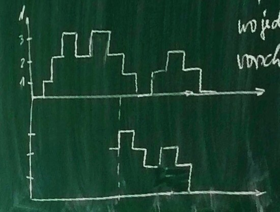

### Aufgabe:
Entwerfen Sie ein Programm mit threadsicheren Warteschleifen (das heißt einreihen und abholen finden unter gegenseitigem Ausschluss statt), dass das einfache 2-Konsensproblem löst.
Einfaches Konsensproblem: Konsensproblem, wo jeder Thread seine eigene Thread-ID vorschlägt.

#### Lösung:
`queue` sei als globale Variable gegeben.

	init():
		Sei queue eine Warteschlange.
		einreihen(queue, 1);
		einreihen(queue, 2);
	
	entscheide(queue, i, a):	// i = Thread-ID
		abholen(queue, status);
		Falls status = 1, dann:
			a := i;		// Thread i gewinnt
		Sonst:
			a := 3 - i	// Rivale von Thread i gewinnt
	
	|   |
	|   |
	|___|
	|_2_|
	|_1_|

Einigkeit:
Sei i ∈ {1, 2} derjenige Thread, dessen abholen-Aufruf als erstes ausgeführt wird. Thread i bekommt status = 1 und damit a = i. Sein Rivale (Thread 3 - i) bekommt status = 2 und damit a = 3 - (3 - i) = i. Also gilt Einigkeit.

Gültigkeit:  
Sei i ∈ {1, 2} derjenige Thread, dessen abholen-Aufruf als erstes ausgeführt wird. Thread i bekommt status = 1 und damit a = i. Den Wert i hat er selber vorgeschlagen. Sein Rivale (Thread 3 - i) bekommt status = 2 und a = i. Da der Rivale verloren hat (Thread i hat gewonnen), muss der Thread i einen Vorschlag gemacht haben (i wegen einfachem Konsensproblem). Also gilt Gültigkeit.

### Aufgabe:
Angenommen, zwei atomare Befehle `getAndInc` und `getAndDec` stehen zur Verfügung. Wie kann man damit Sperren implementieren?

	getAndInc(c, b):				getAndDec(c, b):
		b := c;							b := c;
		c := c + 1;						c := c - 1;

#### Lösung:
Java-Paket: `java.util.concurrent.atomic`  
Klasse: `AtomicInteger`

	public class … extends AtomicInteger implements Lock {
		public IntegerLock(int i) {
			super(i);
		}
	}
	
	@override
	public void lock() {
		int b = this.getAndIncrement(); // (1)
		while (b > 0) {					// (2)
			this.getAndDecrement();		// (3)
			b = this.getAndDecrement();	// (4)
		}
	}
	
	@override
	public void unlock() {
		this.getAndDecrement();			// (5)
	}

```
	Ablauf für 2 Threads:   // ↙ gem. Var. vom Typ IntegerLock
	     p₁    |     p₂     | c | Bedingung
	–––––––-–––+––––––––––––+–––+––––––––––
	Aktion | b | Aktion |   | 0 |
	–––––––+–––+––––––––+–––+–––|
	  (1)  | 0 |        |   | 1 |
	       |   |  (1)   | 1 | 2 |
	       |   |  (2)   |   |   | true
	       |   |  (3)   |   | 1 |
	       |   |  (4)   | 1 | 2 |
	  (2)  |   |        |   |   | false
	  (5)  |   |        |   | 1 |
	       |   |  (2)   |   |   | true
	       |   |  (3)   |   | 0 |
	       |   |  (4)   | 0 | 1 |
	       |   |  (2)   |   |   | false
```
### Aufgabe: Atomic Boolean
a) Ersetzen Sie in der Zähler-Aufgabe die Anweisung

	lock = new ReentrantLock();

durch die Anweisung

	lock = new TASLock();

Implementieren Sie dazu die Schnittstelle `Lock` durch die Klasse `TASLock` wie folgt:

	import java.util.concurrent.atomic.*;
	
	public class TASLock implements java.util.concurrent.Locks.Lock {
		AtomicBoolean b = new AtomicBoolean(false);
		
		public void lock() {
			while (b.getAndSet(true)) {
			}
		}
		
		public void unlock() {
			b.set(false);
		}
	}

Vergleichen Sie Ergebnis und Bearbeitungszeit.

b) Variante: `TTASLock`.  
Im Rumpf von `lock` soll `b.getAndSet` erst dann versucht werden, wenn `b.get()` den Wert `false` liefert.

c) Variante: IDLock.  
Statt `AtomicBoolean` mit `getAndSet` und `set` soll `AtomicInteger` mit `getAndIncrement` und `getAndDecrement` verwendet werden.

##### Hinweise zu Aufgabe 2 mit Sperren:
	z++;

wird geändert zu

	l.lock();
	try {
		z++;
	}
	finally {
		l.unlock();
	}

Deklaration von l:

	static Lock l;

Im Hauptprogramm:

	l = new ReentrantLock();

### Aufgabe:
Drei Prozessoren A, B, C seien mit einem Speicherblock M über einen Bus verbunden. Geben Sie den Ablauf wieder inklusive der Änderungen am Zwischenspeicher, wenn nacheinander folgende Anweisungen ausgeführt werden.

a) Prozessor A führt `getAndInc(c, b)` aus  
b) Prozessor A führt `getAndInc(c, b')` aus  
c) Prozessor B führt `getAndDec(c, b")` aus

##### Lösung:
	getAndInc(c, b):
		b := c;
		c := c + 1;

Zugriffe:
1. c lesen
2. b schreiben
3. c schreiben

###### a)
1. A liest c

	```
		    A        B        C        M
		  –––––    –––––    –––––    –––––
		E | c |    |   |    |   |    | c |
		  –––––    –––––    –––––    –––––
		____|________|________|________|
	```

2. A schreibt b

	```
		    A        B        C        M
		  –––––    –––––    –––––    –––––
		E | c |    |   |    |   |    | c |
		M | b |    |   |    |   |    |   |
		  –––––    –––––    –––––    –––––
		____|________|________|________|
	```

3. A schreibt c

	```
		    A        B        C        M
		  –––––    –––––    –––––    –––––
		M | c'|    |   |    |   |    | c |
		M | b |    |   |    |   |    |   |
		  –––––    –––––    –––––    –––––
		____|________|________|________|
	```

###### b) (keine Änderung)
1. A liest c
2. A schreibt b
3. A schreibt c

	```
		    A        B        C        M
		  –––––    –––––    –––––    –––––
		M | c'|    |   |    |   |    | c |
		M | b |    |   |    |   |    |   |
		  –––––    –––––    –––––    –––––
		____|________|________|________|
	```

###### c)
1. B liest c. Das führt dazu, dass A c auf den Speicher schreibt. B bekommt den geschriebenen Wert auch mit.

	```
		    A        B        C        M
		  –––––    –––––    –––––    –––––
		S | c'|  S | c |    |   |    | c'|
		M | b |    |   |    |   |    |   |
		  –––––    –––––    –––––    –––––
		____|________|________|________|
	```

2. B schreibt `b"`

	```
		    A        B        C        M
		  –––––    –––––    –––––    –––––
		S | c'|  S | c |    |   |    | c'|
		M | b |  M | b"|    |   |    |   |
		  –––––    –––––    –––––    –––––
		____|________|________|________|
	```

3. B schreibt c

	```
		    A        B        C        M
		  –––––    –––––    –––––    –––––
		I | c'|  M | c |    |   |    | c'|
		M | b |  M | b"|    |   |    |   |
		  –––––    –––––    –––––    –––––
		____|________|________|________|
	```
## Klausurvorbereitung
### Aufgabe 1:
Gegeben sei folgendes Programmgragment:

	[1] belegen(l);
	[2] solange ¬C wiederhole
	[3]     freigeben(l);
	[4]     Eine Weile warten;
	[5]     belegen(l);
	[6] P
	[7] freigeben(l);

Dabei sei C eine Bedingung an den Zustand und P sei ein Programmfragment.

Die Sperre l komme weder in C noch in P vor. Es darf vorrausgesetzt werden, dass die Sperre l an keiner anderen Stelle belegt oder freigegeben wird. Alle Markierungen beziehen sich auf den Zeilenanfang, das heißt die Stelle vor der Anweisung.

a) Zeigen Sie, dass `belegen(l)` und `freigeben(l)` immer abwechselnd aufgerufen werden. (2 Punkte)

> ##### Lösung:
> 1. Fall: Schleife wird nicht durchlaufen, das heißt C gilt von Anfang an. Es wird `belegen(l)`, P, `freigeben(l)` ausgeführt.
> 2. Fall: Schleife wird durchlaufen, das heißt C gilt am Anfang nicht. Vor dem ersten `freigeben(l)` (Zeile[3]) kommt `belegen(l)` (Zeile [1]). Vor `belegen(l)` in Zeile [5] kommt `freigeben(l)` in Zeile [3]. Vor `freigeben(l)` in Zeile [3], wenn die Schleife bereits durchlaufen wurde, kommt `belegen(l)` in Zeile [5]. Vor dem `freigeben(l)` in Zeile [7] kommt `belegen(l)` in Zeile [5].

b) Auf welche Variablen darf in C und in P zugegriffen werden? (2 Punkte)

> ##### Lösung:
> Auf alle nicht-gemeinsamen Variablen und auf die von der Sperre `l` bewachten Variablen.

c) Für eine Bedingung B gelte folgendes:

1. Nach der Initialisierung des Systems gilt B.
2. Wenn B an der Stelle [2] gilt, dann gilt B auch an der Stelle [3].
3. Wenn B an der Stelle [6] gilt, dann gilt B auch an der Stelle [7].

Zeigen Sie, dass B immer auch an der Stelle [2] gilt. Berücksichtigen Sie dabei insbesondere die Anwesenheit mehrerer nebeneinanderlaufender Threads. (8 Punkte)

> ##### Lösung:
> Threads, die nicht im Besitz der Sperre sind, können am Wert von B nichts ändern. (Wird vorausgesetzt.)
> Wir beweisen, dass B bei allen Threads immer an den Stellen [2] und [6] gilt, durch Induktion nach der Gesamtzahl n der von allen Threads getätigten Aufrufe von `freigeben(l)`.
> Wenn n = 0 gilt, dann gilt B nach Variante 1. Alle anderen Threads können noch nicht den kritischen Bereich betreten haben.
> Sei nun n \> 0. Wenn der letzte `freigeben(l)`-Aufruf des Threads an der Stelle [3] war, dann ist dieser Thread seit Stelle [2] im Besitz der Sperre. Nach Induktionsvorraussetzung gilt B an Stelle [2], und wegen 2. gilt B auch an der Stelle [3]. Seither war kein Thread im kritischen Bereich, also gilt B immer noch. Falls der letzte `freigeben(l)`-Aufruf eines Threads an der Stelle [7] war, gilt entsprechendes.

### Aufgabe 2:
Gegeben sei folgende elementare Ereignisstruktur:

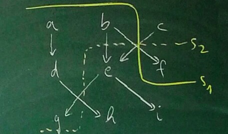

a) Welche der folgenden Abläufe sind damit möglich? (je 1 Punkt)

- α) acdhebifg
- β) cabedihfg
- ɣ) bfacdegih
- δ) abdcehfgi

##### Lösung:
- α) nicht möglich, denn b muss vor e kommen
- β) möglich
- ɣ) möglich
- δ) möglich

b) Welche der Schnitte s₁ und s₂ sind in einem System möglich, das heißt entsprechen einem Zustand, den das System einnehmen kann? (4 Punkte)

##### Lösung:
- s₂ unmöglich, da e → g nicht respektiert wird (e in Zukunft, g in Vergangenheit)
- s₁ unmöglich, da b → f nicht respektiert wird

### Aufgabe 3:
Welche der folgenden Eigenschaften sind Sicherheitseigenschaften [^13]**(S)**, welche sind Liveness-Eigenschaften[^14]? Mit Begründung. (je 1 Punkt)

1. Wenn die Bremsleuchte leuchtet, muss die Bremse betätigt worden sein. **(S)** (*nur Bezug auf Vergangenheit*)
2. Es kommt nicht vor, dass sowohl Zulassventil als auch Ablassventil der Schleuse geöffnet sind. **(S)** (*typisches Verbot*)
3. Wenn Kunden warten, wird der Friseur einen Kunden bedienen. **(L)** (*„schließlich“*)
4. Falls der Suchalgorithmus terminiert, ist das Ergebnis ein spezifizierter Wert. **(S)**

### Aufgabe 4:
Ein System habe eine Sperre l und zwei Threads. Zu jedem Thread i ∈ {1, 2} gebe es die Aktionenmenge Aᵢ := {antᵢ, belᵢ, frᵢ}. Weiter sei A := A₁ ∪ A₂.

Jeder der beiden Threads i ∈ {1, 2} verhalte sich als Zustandsautomat wie folgt:

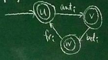

a) Geben Sie für die Menge der endlichen Abläufe von Thread i einen regulären Ausdruck an. (3 Punkte)

##### Lösung:
(antᵢ belᵢ frᵢ)\* (ε ∪ antᵢ ∪ antᵢ belᵢ)  
oder  
(antᵢ belᵢ frᵢ)\* (ε ∪ antᵢ (ε ∪ belᵢ)

b) (Bed. antᵢ, belᵢ, frᵢ wie in der Vorlesung)  
Wie kann man die Zustände u, v, w umgangssprachlich charakterisieren? (3 Punkte)

##### Lösung:
w: innerhalb des kritischen Bereiches  
v: wartend auf die Sperre  
u: außerhalb kritischer Bereiche

c) Ein Zustand des Gesamtsystems sei gegeben durch ein Paar (s₁, s₂ wobei s₁ der Zustand des Threads 1 und s₂ der Zustand des Threads 2 ist. Welche Zustände des Gesamtsystems widersprechen sich der Forderung nach gegenseitigem Ausschluss? (2 Punkte)

##### Lösung:
Nur (w, w) ist ausgeschlossen.

d) Was wird mit folgenden Formeln ausgedrückt? (je 2 Punkte)

- α) ☐ ant₁ ⇒ ◯♢ (ant₁ ∨ ant₂)

##### Lösung
Auf jeden Antrag von Thread 1 folgt schließlich ein Antrag von Thread 1 oder Thread 2.
 
- β) ∀y \<\_{pre} x: 0 ≤ #y ant₁ - #y fr₁ ≤ 1

##### Lösung:
Zu jedem Zeitpunkt y in dem Ablauf x gilt: Erst nachdem Thread 1 die Sperre freigegeben hat, kann er sie wieder beantragen.

- ɣ) π\_{bel₁, fr₁, bel₂, fr₂} (x) ∉ A\* {bel₁ bel₂, bel₂ bel₁} A\*

##### Lösung:
Zwischen zwei Belegungen in x muss mindestens eine Freigabe liegen.

e) Drücken Sie mit temporallogischen Formeln aus: (je 2 Punkte)

- δ) Thread 2 befindet sich unendlich oft in einem kritischen Bereich.

##### Lösung:
☐♢bel₂.

- ε) Jeder Thread, der sich außerhalb eines kritischen Bereiches befindet, beantragt die Sperre.

##### Lösung:
(☐ fr₁ ⇒ ♢ant₁) ∧ (♢ ant₁)  
(☐ fr₂ ⇒ ♢ant₂) ∧ (♢ ant₂)

- ζ) Das System ist verklemmungsfrei.

##### Lösung:
☐ (ant₁ ∨ ant₂) → ♢ (bel₁ ∨ bel₂)

[^1]:	Endliche Folgen

[^2]:	Unendliche Folgen

[^3]:	Leere Aktionenfolge (= Aktionenfolge der Länge 0)

[^4]:	y₀ \<\_{pre} x  
	π\_{B}(y₀) = ε

[^5]:	y₁ \<\_{pre} x  
	π\_{B}(y₁) = (a)

[^6]:	π\_{B}(y₂) = (a, b)

[^7]:	π\_{B}(y₃) = (a, b)

[^8]:	π\_{B}(y₄) = (a, b, a)

[^9]:	„Präfix-Abschluss“

[^10]:	Zeile wurde verändert und andere Prozessoren können diese Zeile in ihrem Zwischenspeicher haben.

[^11]:	First Come First Serve

[^12]:	Ohne Beschränkung der Allgemeinheit

[^13]:	Bezieht sich auf die Vergangenheit.

[^14]:	Verspricht etwas für die Zukunft.