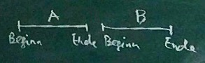

## Thread-Programmierung
### Gliederung
1. Grundbegriffe
	1. Threads
	2. Nicht-Determinismus
	3. Kritische Bereiche
	4. Sperren
2. Verifikation
	1. Zeitliche Abläufe
	2. Serielle Abläufe
	3. Faire Mischung
	4. Sicherheits- und Liveness-Eigenschaften
	5. Modellierung
3. Synchronisation
	1. Signale (Bsp. Erzeuger/Verbraucher)
	2. Semaphore
	3. Bedingte kritische Bereiche
	4. Wiederbehebbare Sperre
	5. Leser/Schreiber-Problem
4. Feinkörnige Nebenläufigkeit
	1. Methoden (Bsp. Mengen)
	2. Grobkörnig
	3. Feinkörnig
	4. Optimistisch
	5. Faul
	6. Mit atomaren Befehlen
5. Implementierung
	1. Atomare Befehle
	2. Konsenzzahlen
	3. Zwischenspeicher
	4. Bäckerei-Algorithmus
6. Transactional Memory
	1. Probleme mit Sperren
	2. Transaktionen
	3. STM: Transaktionsstatus, Transactional Thread, 2 Implementierungen

Literatur:
- Maurice Herlihy, Nir Shavit: The Art of Multiprocessor Programming. Morgan Kaufmann 2008.
- Kelvin Lin, Larry Snyder: Principles of Parallel Programming. Addison Wesley.
- Greg Andrews: Concurrent Programming. Addison Wesley 1991.
- Brian Goetz u.a.: Java Concurrency in Practice. Addison Wesley 2006.

## 1. Grundbegriffe
### 1.1. Threads
**Prozess (hier)** := sequentieller Rechenvorgang  
**Sequentiell (auch: seriell) **:= Alle Rechenschritte laufen nacheinander ab in einer vorgegebenen Reihenfolge.  
**Thread (deutsch: Faden)** := leichte Variante eines Prozesses

###### Allgemeine Tendenz:
1. Systemkern möglichst schlank halten
2. Systemkern möglichst selten betreten

###### Unterschied zu Prozess:
- kein eigener Speicherbereich
- üblicherweise nicht vom Systemkern verwaltet

###### „Leichtprozess“ (engl. light-weight prozess):
- vom Systemkern verwaltet
- Vorteile:
	- Wechsel zwischen Threads weniger aufwendig als Wechsel zwischen Prozessen
	- Threads benötigen weniger Speicher
	- man kann viel mehr Threads (≈10000) als Prozesse (≈100) laufen lassen.
- Nachteile:
	- Der Anwendungsprogrammierer muss sich um die Verwaltung der Threads kümmern 

Viele Programmiersprachen bieten heute Programmbibliotheken für Threads an (Beispiel: PThread in C). Wir verwenden in dieser Veranstaltung Java als Programmiersprache.

**Parallel** := mehrere Threads laufen gleichzeitig auf verschiedenen Rechnerkernen.  
**Verschränkt (engl. interleaved)** := die Threads laufen abwechselnd je ein Stück weit  
**Nebeneinander laufend (auch: nebenläufig, engl. concurrent)** := mehrere Threads laufen parallel oder miteinander verschränkt.  
Auch Mischformen sind möglich.

###### Unterschied:
- **Rechenzeit (engl. CPU time)** := Zeit, die der Prozessor mit Rechnen zubringt
- **Bearbeitungszeit (engl. wall clock time)** := umfasst auch Wartezeiten

##### Amdahlsches Gesetz (Gene Amdahl 1967):
> Wenn eine Aufgabe die Bearbeitungszeit a benötigt, und der Anteil 0 ≤ p ≤ 1 davon parallelisiert ist, dann benötigt sie die Bearbeitungszeit  
> `a * (1 - p + p/n)`.

Beispiel: `p = 9/10, n = 100`.
Beschleunigung (engl. speedup)  
= `a / (a * (1 - p + p/n))`  
= `1 / (1 - 9/10 + 9/1000)`  
≈ 9,17

Sogar `lim[n → ∞] 1 / (1 - p + p/n)` = `1 / (1 - p)` = 10.

*Fazit*: Der nicht-parallelisierbare Anteil dominiert die Bearbeitungszeit.

### 1.2. Nicht-Determinismus
**Nicht-Determinismus** := das Verhalten eines Systems hat Freiheitsgrade
Nicht-Determinismus hat zwei Anwendungen:
1. Möglichkeiten des Verhaltens der Systemumgebung zusammenfassen (engl. don’t know nondeterminism).
2. Spielraum für Implementierungen (engl. don’t care nondeterminism).

Hier: System von Threads.  
Man muss davon ausgehen, dass die Rechenschritte des Threads beliebig miteinander verschränkt sind. Die Reihenfolge der Schritte eines Threads ist durch sein Programm vorgegeben („Programm-Reihenfolge“).

Der *Zeitplaner* (engl. scheduler) legt zur Laufzeit fest, in welcher Reihenfolge die Schritte zweier Threads zueinander ablaufen. Man möchte den Zeitplaner in seiner Entscheidungsfreiheit nicht unnötig einschränken, sondern einen möglichst großen Spielraum lassen. Man verlangt deshalb, dass das System von Threads korrekt arbeitet unabhängig davon, wie der Zeitplaner die Verschränkung bildet. Don’t know nondeterminism aus Sicht des Anwendungsprogrammierers, don’t care nondeterminism aus Sicht des Zeitplaners.

Beispiel:  
Thread 1 führt aus ① ② ③.  
Thread 2 führt aus ⓐ ⓑ ⓒ.  
Beispiele für mögliche Abläufe:

- ① ⓐ ② ⓑ ③ ⓒ (blau)
- ⓐ ⓑ ⓒ ① ② ③ (rot)
- ⓐ ① ⓑ ② ⓒ ③ (schlamm)
- …


Da bei jedem Test der Zeitplaner eine andere Ausführungsreihenfolge („Umstände des Wettrennens“, engl. race condition) wählen kann, ist der Test praktisch nicht reproduzierbar. Wegen der großen Anzahl möglicher Abläufe ist ein systematisches Testen aussichtslos („Zustandsexplosion“).

Der Entickler muss deswegen die Korrektheit seines Programmes mathematisch beweisen („verifizieren“). Um Flüchtigkeitsfehler und übersehene Spezialfälle auszuschließen, führt man die Beweise mit Assistenzwerkzeugen durch und lässt die Beweise maschinell überprüfen: „Formale Verfifikation“.

Threads sind asynchron, das heißt, sie laufen mit verschiedenen Geschwindigkeiten. Es treten Wartezeiten auf, deren Zeitpunkt und Dauer nicht vorhersehbar ist, z.B. eine neue Speicherseite muss geladen werden („page fault“), oder ein Zugriff auf den Zwischenspeicher (cache) scheitert.

### 1.3. Kritische Bereiche
Beispiel: Zähler mit Threads *z* ist eine *gemeinsame Variable* (auch: gemeinsamer Speicher, engl. shared memory,  gemeinsames Objekt)

z++ wird vom Compiler sinngemäß so übersetzt:

1. `int temp := z;`
2. `temp := temp + 1;`
3. `z := temp;`

Beispielablauf für 3 verschiedene Threads:  
Sei z = 0 zu Anfang. Jeder Thread hat seine Version von temp. Der Wert von *z* sollte am Ende 3 sein.

```
	      p1      |       p2      |       p3      | z
	--------------|---------------|---------------|---
	Zeile | temp1 | Zeile | temp2 | Zeile | temp3 | 0
	------|-------|-------|-------|-------|-------|---
	   1  |   0   |       |       |       |       |
	      |       |   1   |   0   |       |       |
	      |       |   2   |   1   |       |       |
	      |       |   3   |       |       |       | 1
	      |       |       |       |   1   |   1   |
	      |       |       |       |   2   |   2   |
	      |       |       |       |   3   |       | 2
	   2  |   1   |       |       |       |       |
	   3  |       |       |       |       |       | 1
```

Threads p1, p2 p3 kommen sich gegenseitig in die Quere: *Einmischung* (eng. interference). Einmischung kann es nur über gemeinsame Variablen geben. Eine Methode, Einmischung zu verhindern, ist die Verwendung von kritischen Bereichen.

Kritischer Bereich (auch: kritischer Abschnitt, engl. critical region, critical section) := Programmfragment, in dem sich zu jedem Zeitpunkt höchstens ein Thread befindet.

Ein kritischer Bereich ist ein „exklusives“ Betriebsmittel. Wenn sich ein Thread im kritischen Bereich befindet, dann werden alle anderen Threads davon abgehalten, den kritischen Bereich zu betreten (*„gegenseitiger Ausschluss“*, engl. mutual exclusion).

Beispiele für exklusive Betriebsmittel:
- Rechnerkern
- Schreibzugriff auf Speicherblock
- Schreibzugriff auf Bus
- Drucker

Schreibweise: `gemeinsam int z := 0;`  
(deklariert eine gemeinsame Variable z)

	kritisch z {
		z++
	}

Nur innerhalb des kritischen Bereichs darf auf die gemeinsame Variable zugegriffen werden. Wenn kritische Bereiche als Sprachkonstrukt gegeben sind, kann der Compiler die korrekte Verwendung kritischer Bereiche überprüfen.

### 1.4. Sperren
Sperre (engl. lock) := Datenstruktur mit zwei möglichen Zuständen („belegt“ und „frei“) und zwei Zugriffsoperationen („belegen“ und „freigeben“).

Sperre `l` ist frei, wenn `l.frei` = `true`.

	belegen(l):
		Warten solange l.frei = false.
		Setze l.frei = false.
	
	freigeben(l):
		Setze l.frei = true.

Sperren können verwendet werden, um kritische Bereiche zu implementieren.

Beispiel: Sperre `l` beacht die gemeinsame Variable *z*.  
Programm:
- Sperre `l` anlegen mit `l.frei = false`.
- Threads anlegen. Setze gemeinsame Variable z = 0.
- `freigeben(l)`.

Thread: 
- ⓪ `belegen(l);`
- ① ② ③ `z++;`
- ④ `freigeben(l);`

Beispielablauf für 2 Threads nach `freigeben(l)` des Hauptprogramms:

```
	      p1      |       p2      | z | l.frei | Bemerkung
	--------------|---------------|---|--------|----------
	Zeile | temp1 | Zeile | temp2 | 0 |  true  |
	------|-------|-------|-------|   |        |
	   0  |       |       |       |   |  false |
	      |       |   0   |       |   |        | p2 wartet in Z. 0
	   1  |   0   |   0   |       |   |        |
	   2  |   1   |   0   |       |   |        | 
	   3  |       |   0   |       | 1 |        |
	   4  |       |   0   |       |   |  true  |
	      |       |   0   |       |   |  false | Ende der Wartezeit
	      |       |   1   |   1   |   |        |
	      |       |   2   |   2   |   |        |
	      |       |   3   |       | 2 |        |
	      |       |   4   |       |   |  true  |
```

Sprechweise:
- „Thread `p` *bewirbt sich* für die Sperre `l`“ bedeutet: `p` ruft `belegen(l)` auf
- „`p` *erwirbt* `l`“ bedeutet: `p` betritt den kritischen Bereich; p beendet den Aufruf `belegen(l)`.
- „`p` *besitzt* `l`“ bedeutet: `p` ist im kritischen Bereich
- Streit um die Sperre (engl. lock contention)

## 2. Verifikation
### 2.1. Zeitliche Abläufe
Vorgegeben: Menge A von Aktionen

**Ereignis (hier)** := Paar bestehend aus Aktion und Zeitpunkt

Zu einem Ereignis e soll `aktion(e)` die Aktion ausdrücken und `zeit(e)` den Zeitpunkt, an dem die Aktion stattfindet.

Idealisierende Annahmen:
1. Alles findet praktisch am selben Ort statt (sonst: verteilte Systems)
	→ Keine Probleme mit der Lichtgeschwindigkeit
	Zeit (hier) := Newtonsche Zeit
	Zeitpunkte := reelle Zahlen
	Newtonsche Zeit verläuft:
	- absolut, das heißt unabhängig vom Beobachter (sonst: spezielle Relativitätstheorie)
	- stetif, das heißt ohne Sprünge (sonst: Quantenmechanik)
	- unbeeinflusst von der Umgebung (z.B. Temperatur, sonst: allgemeine Relativitätstheorie)
2. Ein Ereignis hat die Dauer Null.
	Einen Zeitraum kann man darstellen durch die Ereignisse „Beginn des Zeitraumes“ und „Ende des Zeitraumes“.
3. Gleichzeitige Ereignisse sind gleich:
	`zeit(e₁) = zeit(e₂)` ⇒ `e₁ = e₂`

**Diskreter zeitlicher Ablauf (auch: Geschichte)** := Menge E von Ereignissen sodass

1. die Menge der Zeitpunkte von E keinen Häufungspunkt und
2. die Menge der Zeitpunkte von E ein kleinstes Element hat.

Sonst: kontinuierliche Vorgänge (Reaktive Systeme).

Inkrement sind hier nicht die Zeitpunkte selber, sondern nur deren Lage zueinander, das heißt die Reihenfolge der Aktionen. Sonst: Echtzeitsysteme.

Relation „→“ „kommt vor“ zwischen Ereignissen ist definiert als:

	e₁ → e₂ ⟺ zeit(e₁) < zeit(e₂)
(Leslie Lamport 1978)

Es gilt: → ist irreflexiv, transitiv, total, fundiert (also eine Wohlordnung).

##### Definition
Eine Relation R ≤ E ⨉ E auf der Menge E heißt

- *irreflexiv,* falls für alle e ∈ E gilt, (e, e) ∉ R.
- *transitiv,* falls für alle e₁, e₂, e₃ ∈ E gilt:
	Falls (e₁, e₂) ∈ R und (e₂, e₃) ∈ R, dann (e₁, e₃) ∈ R.
- *total,* für alle e₁, e₂ ∈ E gilt:
	Falls e₁ ≠ e₂, dann (e₁, e₂) ∈ R oder (e₂, e₁) ∈ R.
- *fundiert,* falls es keine unendliche Folge (eᵢ)\_(i ∈ N) gibt mit eᵢ ∈ E für alle i ∈ N  
	i ↦ eᵢ  
	und (eᵢ, eᵢ₊₁) ∈ R für alle i ∈ N.

###### Einschub:
R ist *azyklisch,* falls es keine endliche Folge (e₁, … eᵢ) gibt mit (e₁, e₂) ∈ R, (e₂, e₃) ∈ R, …, (eᵢ₋₁, eᵢ) ∈ R, (eᵢ, e₁) ∈ R.

Es gilt: Falls R irreflexiv und transitiv ist, dann ist R auch azyklisch. Für eine nicht leere Geschichte E sei *min E* definiert als das kleinste Element von E bezüglich →, das heißt dasjenige e ∈ E, für das gilt: ∀ f ∈ E \\{e}: e → f  
(Das ist eine implizite Definition, also schlecht. [Anm. d. schreib. Stud.])

**Implizite Definition** := Definition durch eine charakteristische Eigenschaft.

**Wohldefiniertheit der impliziten Definition** := Es gibt genau ein Objekt, das die charakteristische Eigenschaft erfüllt.

Wohldefiniertheit von *min E* gilt, weil → total und E (mindestens) ein kleinstes Element hat.

Das i-te Ereignis aus E (in Symbolen Eⁱ) ist dann für i ∈ N, i ≤ |E| rekursiv definiert durch

	Eⁱ = { min E, falls i = 1,
	     { (E\{min E}ⁱ⁻¹, sonst

Auch hier ist die Wohldefiniertheit zu zeigen.

Projektion auf eine Menge B von Aktionen („Sicht“):

	(π_B)(E) := {e ∈ E | aktion(e) ∈ B}

Zustand zum Zeitpunkt t ∈ R:

	(z_t)(E) := {e ∈ E | zeit(e) < t}.

„→“ für Zeiträume:



A → B: ⟺ Ende des Zeitraums A kommt vor Beginn des Zeitraums B  
Es gilt: → für Zeiträume ist **nicht** total.  
Wenn sich A und B überlappen, gilt weder A → B noch B → A.

**Prozessalphabet ⍺(p)** := Menge der Aktionen, die der Thread p „sieht“

Gemeinsame Aktionen von p₁ und p₂: ⍺(p₁)∩⍺(p₂)

**Einigkeit (engl. match)** := Ereignisse mit gemeinsamen Aktionen finden gemeinsam statt:

1. (π\_(⍺(p₁)∩⍺(p₂))(E₁∪E₂) = E₁∩E₂
	Gleichwertig zu 1. sind:
2. (π\_(⍺(p₁)∩⍺(p₂))(E₁⊗E₂) = Ø
3. (π\_⍺(p₁)(E₂) = (π\_⍺(p₂)(E₁)


Eᵢ Ereignisse von Thread i  
Es gilt: ∀ e ∈ Eᵢ: aktion(e) ∈ ⍺(pᵢ)  
Faire Mischung: E₁∪E₂  
Es gilt: (π\_⍺(pᵢ))(E₁∪E₂) = Eᵢ, für i ∈ {1, 2}, falls sich p₁ und p₂ einig sind.

### 2.2. Serielle Abläufe
Wenn man nicht an den Zeitpunkten der Ereignisse interessiert ist, sondern nur an ihrer Lage zueinander, kann man statt einer Ereignismenge auch eine Aktionenfolge als Beschreibungsmittel für einen Ablauf nehmen.

Beispiele: Sei A = {a, b}.  
Endliche Folge (a, b, a) kann auch dargestellt werden als Funktion  
f: {1, 2, 3} → A mit

	f(x) = { a, falls x = 1 oder x = 3,
	       { b, sonst.

Wertetabelle von f:

```
	  x  | 1 2 3
	-----|-------
	f(x) | a b a
```
Unendliche Folge (a, b, b, a, b, b, …) als Funktion f: N → A mit

	f(x) = { a, falls x mod 3 = 1
	       { b, sonst.

(Miteinander identifiziert:)  
Aᵏ k-Tupel von Elementen aus A  
{i ∈ N | i ≤ k} → A Folgen der Länge k

## Seminare
### Aufgabe 1:
Es soll ein Java-Hauptprogramm geschrieben werden, in dem 8 Threads angelegt werden. Jeder Thread *i* soll auf dem Bildschirm ausgeben „Hello World from Thread *i*“.

##### Muster:
	import java.lang.threads.*;
	
	public static void main() {
		Thread[] threads = new Thread[8];
		for (int i = 0; i < 8; i++) {
			final int c = i;
			thread[i] = new Thread(
				new Runnable() {
					public void run() {
						System.out.println(
							"Hello World from Thread " + c
						);
					}
				}
			);
		}
		for (int i = 0; i < 8; i++) {
			thread[i].start();
		}
		for (int i = 0; i < 8; i++) {
			thread[i].join();
		}
	}

### Aufgabe 2:
1. Es soll ein Java-Hauptprogramm geschrieben werden, in dem eine globale Variable *z* auf 0 initialisiert wird und von jedem der 10000 Threads inkrementiert wird. Interpretieren Sie das Ergebnis.
2. Ersetzen Sie z++ durch den Aufruf einer Methode.

##### Muster 1:
	import java.lang.threads.*;
	
	static int z = 0;
	
	public static void main() {
		Thread[] threads = new Thread[8];
		for (int i = 0; i < 10000; i++) {
			final int c = i;
			thread[i] = new Thread(
				new Runnable() {
					public void run() {
						z++;
					}
				}
			);
		}
		for (int i = 0; i < 10000; i++) {
			thread[i].start();
		}
		for (int i = 0; i < 10000; i++) {
			thread[i].join();
		}
	}

##### Muster 2:
	import java.lang.threads.*;
	
	static int z = 0;
	
	public static void main() {
		Thread[] threads = new Thread[8];
		for (int i = 0; i < 10000; i++) {
			final int c = i;
			thread[i] = new Thread(
				new Runnable() {
					public void run() {
						inc();
					}
				}
			);
		}
		for (int i = 0; i < 10000; i++) {
			thread[i].start();
		}
		for (int i = 0; i < 10000; i++) {
			thread[i].join();
		}
	}
	synchronized static void inc() {
		z++;
	}

### Aufgabe: Amdahls Gesetz
1. Finden Sie heraus, welcher Anteil der Zähler-Aufgabe (mit k = 10000 Threads) parallelisierbar ist.
2. Welchen Anteil erwarten Sie für k = 20000 Threads?
3. Wie weit kann man die Bearbeitung durch Parallelisierung beschleunigen, wenn man beliebig viele Prozessoren zur Verfügung hat?

##### Lösung:
Parallelisierter Anteil: `p = ((b / a - 1) * n) / (1 - n)`  
a: serielle Bearbeitungszeit; b: parallele Bearbeitungszeit

Beschleunigung: `1 / (1 - p)`.

### Aufgabe: Verschränkung (1)
Thread p habe m Schritte, Thread q habe n Schritte auszuführen.
1. Geben Sie eine rekursive Definition an für die Anzahl anz(m, n) der möglichen verschränkten Abläufe von p und q.
2. Finden Sie einen geschlossenen Ausdruck für anz(m, n).
3. Schätzen Sie die Größenordnung von anz(n, n).

##### Lösung:
	anz(m, n) = { 1, falls m = 0 oder n = 0
		            { anz(m - 1, n) + anz(m, n - 1), sonst
2. Wegbeschreibung = Bitvektor mit m Nullen und n Einsen  
	(0 ≙ 1 Schritt nach rechts, 1 ≙ 1 Schritt nach unten)
	Länge des Bitvektors ist m + n.
	Isomorph zu Bitvektor mit m Nullen und n Einsen sind n-Teilmengen einer (m+n)-Menge.
	Beispiel: Bitvektor `011010`
	(m+n)-Menge sei `{1, …, m + n}`.
	Dargestellte Teilmenge ist `{2, 3, 5}`.
	Satz: Die Anzahl der k-Teilmengen einer n-Menge ist *n über k* (Binomialkoeffizient).
	Es gilt `anz(m, n)` = `(m + n)` *über* `n`.
3. Behauptung: `anz(n, n)` = `2n` *über* `n` ≥ 2ⁿ.